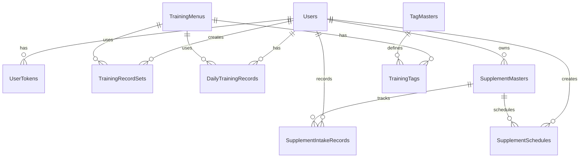

# バックエンド開発ガイド

🏗️ **ASP.NET Core 8.0 による Message システム API 開発**

## 🎯 開発概要

### 技術スタック
- **Framework**: ASP.NET Core 8.0
- **ORM**: Entity Framework Core 8.0
- **Database**: SQL Server 2019/2022
- **Authentication**: JWT + Refresh Token
- **Documentation**: Swagger/OpenAPI
- **Testing**: xUnit, Moq

### 開発範囲
- REST API設計・実装
- データベース設計・マイグレーション
- 認証・認可システム
- ビジネスロジック実装
- エラーハンドリング
- API ドキュメンテーション

## 📋 開発計画

### Phase 1: プロジェクト基盤（3-4日）
- [x] プロジェクト構造設計
- [ ] データベーススキーマ設計
- [ ] 基本的なEntity定義
- [ ] DbContext設定
- [ ] 認証システム基盤

### Phase 2: コア機能実装（5-7日）
- [ ] ユーザー管理API
- [ ] 認証API（Login/Register/Refresh）
- [ ] トレーニングメニューAPI
- [ ] トレーニング記録API
- [ ] サプリメント管理API

### Phase 3: 高度機能・最適化（3-4日）
- [ ] 統計・分析API
- [ ] ファイルアップロード
- [ ] バックグラウンド処理
- [ ] キャッシュ戦略
- [ ] パフォーマンス最適化

## 🏗️ プロジェクト構造

```
api/
├── Controllers/           # API コントローラー
│   ├── AuthController.cs
│   ├── TrainingController.cs
│   ├── SupplementController.cs
│   └── AdminController.cs
├── Models/               # データモデル
│   ├── Entities/        # エンティティクラス
│   ├── DTOs/           # データ転送オブジェクト
│   └── Requests/       # リクエストモデル
├── Services/            # ビジネスロジック
│   ├── IAuthService.cs
│   ├── AuthService.cs
│   ├── ITrainingService.cs
│   └── TrainingService.cs
├── Data/               # データアクセス層
│   ├── MessageDbContext.cs
│   ├── Repositories/
│   └── Migrations/
├── Common/             # 共通機能
│   ├── Exceptions/
│   ├── Extensions/
│   ├── Helpers/
│   └── Constants/
├── Configuration/      # 設定クラス
├── Middleware/        # カスタムミドルウェア
└── Tests/            # テスト
    ├── Unit/
    ├── Integration/
    └── TestData/
```

## 📊 データベース設計

### エンティティ関係図


### 主要テーブル設計

#### Users テーブル
```sql
CREATE TABLE users (
    user_id INT IDENTITY(1,1) PRIMARY KEY,
    user_common_id NVARCHAR(16) UNIQUE NOT NULL,
    login_id NVARCHAR(256) UNIQUE NOT NULL,
    password_hash NVARCHAR(512) NOT NULL,
    password_salt NVARCHAR(512) NOT NULL,
    display_name NVARCHAR(100),
    created_at DATETIME2 DEFAULT GETDATE(),
    updated_at DATETIME2 DEFAULT GETDATE()
);
```

#### Training関連テーブル
```sql
-- トレーニングメニュー
CREATE TABLE training_menus (
    menu_id NVARCHAR(64) PRIMARY KEY,
    jp_name NVARCHAR(100) NOT NULL,
    en_name NVARCHAR(100) NOT NULL,
    description NVARCHAR(MAX),
    created_at DATETIME2 DEFAULT GETDATE()
);

-- トレーニング記録セット
CREATE TABLE training_record_sets (
    record_id INT IDENTITY(1,1) PRIMARY KEY,
    user_common_id NVARCHAR(16) NOT NULL,
    menu_id NVARCHAR(64) NOT NULL,
    training_date DATE NOT NULL,
    set_number INT NOT NULL,
    reps INT NOT NULL,
    weight DECIMAL(5,2),
    memo NVARCHAR(MAX),
    created_at DATETIME2 DEFAULT GETDATE(),
    CONSTRAINT FK_training_record_user FOREIGN KEY (user_common_id) REFERENCES users(user_common_id),
    CONSTRAINT FK_training_record_menu FOREIGN KEY (menu_id) REFERENCES training_menus(menu_id)
);
```

#### Supplement関連テーブル
```sql
-- サプリメントマスタ
CREATE TABLE supplement_masters (
    supplement_id INT IDENTITY(1,1) PRIMARY KEY,
    user_id INT NOT NULL,
    supplement_name NVARCHAR(100) NOT NULL,
    unit NVARCHAR(20) NOT NULL,
    description NVARCHAR(MAX),
    is_active BIT DEFAULT 1,
    created_at DATETIME2 DEFAULT GETDATE(),
    updated_at DATETIME2 DEFAULT GETDATE(),
    CONSTRAINT FK_supplement_user FOREIGN KEY (user_id) REFERENCES users(user_id)
);

-- サプリメント摂取記録
CREATE TABLE supplement_intake_records (
    record_id INT IDENTITY(1,1) PRIMARY KEY,
    user_id INT NOT NULL,
    supplement_id INT NOT NULL,
    intake_date DATE NOT NULL,
    intake_time TIME NOT NULL,
    amount DECIMAL(10,2) NOT NULL,
    timing_type NVARCHAR(20),
    memo NVARCHAR(MAX),
    created_at DATETIME2 DEFAULT GETDATE(),
    CONSTRAINT FK_intake_user FOREIGN KEY (user_id) REFERENCES users(user_id),
    CONSTRAINT FK_intake_supplement FOREIGN KEY (supplement_id) REFERENCES supplement_masters(supplement_id)
);
```

## 🔐 認証システム実装

### JWT設定
```csharp
// Program.cs
builder.Services.AddAuthentication(JwtBearerDefaults.AuthenticationScheme)
    .AddJwtBearer(options =>
    {
        options.TokenValidationParameters = new TokenValidationParameters
        {
            ValidateIssuer = true,
            ValidateAudience = true,
            ValidateLifetime = true,
            ValidateIssuerSigningKey = true,
            ValidIssuer = builder.Configuration["Jwt:Issuer"],
            ValidAudience = builder.Configuration["Jwt:Audience"],
            IssuerSigningKey = new SymmetricSecurityKey(
                Encoding.UTF8.GetBytes(builder.Configuration["Jwt:Key"]))
        };
    });
```

### AuthService実装パターン
```csharp
public interface IAuthService
{
    Task<AuthResult> LoginAsync(LoginRequest request);
    Task<AuthResult> RegisterAsync(RegisterRequest request);
    Task<AuthResult> RefreshTokenAsync(string refreshToken);
    Task<bool> RevokeTokenAsync(string refreshToken);
}

public class AuthService : IAuthService
{
    private readonly MessageDbContext _context;
    private readonly IConfiguration _configuration;
    
    public async Task<AuthResult> LoginAsync(LoginRequest request)
    {
        // 1. ユーザー検索
        var user = await _context.Users
            .FirstOrDefaultAsync(u => u.LoginId == request.Email);
            
        if (user == null || !VerifyPassword(request.Password, user.PasswordHash, user.PasswordSalt))
        {
            return AuthResult.Failed("Invalid credentials");
        }
        
        // 2. JWT生成
        var accessToken = GenerateAccessToken(user);
        var refreshToken = GenerateRefreshToken();
        
        // 3. リフレッシュトークン保存
        await SaveRefreshTokenAsync(user.UserCommonId, refreshToken);
        
        return AuthResult.Success(accessToken, refreshToken, user);
    }
}
```

## 🎯 API実装パターン

### コントローラー基底クラス
```csharp
[ApiController]
[Authorize]
public abstract class BaseController : ControllerBase
{
    protected string GetCurrentUserId()
    {
        return User?.FindFirstValue("user_id");
    }
    
    protected IActionResult HandleResult<T>(Result<T> result)
    {
        if (result.IsSuccess)
        {
            return Ok(new ApiResponse<T>
            {
                Success = true,
                Data = result.Value
            });
        }
        
        return BadRequest(new ApiResponse<T>
        {
            Success = false,
            Message = result.Error
        });
    }
}
```

### 標準的なコントローラー実装
```csharp
[Route("api/[controller]")]
public class SupplementController : BaseController
{
    private readonly ISupplementService _supplementService;
    
    public SupplementController(ISupplementService supplementService)
    {
        _supplementService = supplementService;
    }
    
    [HttpGet("supplements")]
    public async Task<IActionResult> GetSupplements()
    {
        var userId = GetCurrentUserId();
        var result = await _supplementService.GetSupplementsAsync(userId);
        return HandleResult(result);
    }
    
    [HttpPost("supplements")]
    public async Task<IActionResult> CreateSupplement([FromBody] CreateSupplementRequest request)
    {
        var userId = GetCurrentUserId();
        var result = await _supplementService.CreateSupplementAsync(userId, request);
        return HandleResult(result);
    }
}
```

## 📝 実装チェックリスト

### Phase 1: 基盤構築
- [ ] **プロジェクト作成**: .NET 8.0 Web API
- [ ] **NuGetパッケージ**: 
  - `Microsoft.EntityFrameworkCore.Design`
  - `Microsoft.EntityFrameworkCore.Tools`
  - `Microsoft.EntityFrameworkCore.SqlServer`
  - `Microsoft.AspNetCore.Authentication.JwtBearer`
  - `Swashbuckle.AspNetCore`
- [ ] **データベース接続**: SQL Server接続文字列設定
- [ ] **Entity定義**: User, TrainingMenu, SupplementMaster等
- [ ] **DbContext設定**: MessageDbContext作成
- [ ] **マイグレーション**: 初期マイグレーション作成・適用
- [ ] **認証設定**: JWT認証設定

### Phase 2: 認証API
- [ ] **AuthController**: Login, Register, Refresh, Logout
- [ ] **AuthService**: パスワードハッシュ化、JWT生成
- [ ] **ミドルウェア**: エラーハンドリング
- [ ] **バリデーション**: リクエストデータ検証
- [ ] **テスト**: 認証フローの単体・統合テスト

### Phase 3: トレーニングAPI
- [ ] **TrainingController**: CRUD操作
- [ ] **TrainingService**: ビジネスロジック
- [ ] **統計機能**: 進捗計算、レコード管理
- [ ] **データ検証**: 入力値チェック
- [ ] **テスト**: トレーニング機能テスト

### Phase 4: サプリメントAPI
- [ ] **SupplementController**: CRUD + 摂取記録 + スケジュール
- [ ] **SupplementService**: サプリメント管理ロジック
- [ ] **通知機能**: リマインダーロジック（バックグラウンド処理）
- [ ] **統計機能**: 摂取状況分析
- [ ] **テスト**: サプリメント機能テスト

### Phase 5: 最適化・デプロイ
- [ ] **キャッシュ**: Redis統合（任意）
- [ ] **ログ**: Serilog設定
- [ ] **監視**: ヘルスチェック
- [ ] **Docker**: コンテナ化
- [ ] **CI/CD**: GitHub Actions設定

## 🧪 テスト戦略

### 単体テスト
```csharp
public class AuthServiceTests
{
    [Fact]
    public async Task LoginAsync_ValidCredentials_ReturnsSuccess()
    {
        // Arrange
        var context = GetInMemoryDbContext();
        var service = new AuthService(context, GetConfiguration());
        
        // Act
        var result = await service.LoginAsync(new LoginRequest
        {
            Email = "test@example.com",
            Password = "password123"
        });
        
        // Assert
        Assert.True(result.IsSuccess);
        Assert.NotNull(result.AccessToken);
    }
}
```

### 統合テスト
```csharp
public class SupplementControllerTests : IClassFixture<WebApplicationFactory<Program>>
{
    [Fact]
    public async Task GetSupplements_Authenticated_ReturnsSupplements()
    {
        // Arrange
        var client = _factory.CreateClient();
        client.DefaultRequestHeaders.Authorization = 
            new AuthenticationHeaderValue("Bearer", GetValidToken());
        
        // Act
        var response = await client.GetAsync("/api/supplement/supplements");
        
        // Assert
        response.EnsureSuccessStatusCode();
        var content = await response.Content.ReadAsStringAsync();
        var result = JsonSerializer.Deserialize<ApiResponse<List<SupplementDto>>>(content);
        Assert.True(result.Success);
    }
}
```

## 🔧 設定ファイル

### appsettings.json
```json
{
  "ConnectionStrings": {
    "DefaultConnection": "Server=localhost;Database=MessageDB;Trusted_Connection=true;TrustServerCertificate=true;MultipleActiveResultSets=true"
  },
  "Jwt": {
    "Key": "your-secret-key-here-minimum-32-characters",
    "Issuer": "MessageAPI",
    "Audience": "MessageClients",
    "AccessTokenExpirationMinutes": 60,
    "RefreshTokenExpirationDays": 7
  },
  "Logging": {
    "LogLevel": {
      "Default": "Information",
      "Microsoft.AspNetCore": "Warning"
    }
  },
  "AllowedHosts": "*"
}
```

## 📊 パフォーマンス考慮事項

### データベース最適化
```csharp
// インデックス設定
modelBuilder.Entity<TrainingRecordSet>()
    .HasIndex(e => new { e.UserCommonId, e.TrainingDate })
    .HasDatabaseName("IX_TrainingRecordSet_User_Date");

// クエリ最適化
public async Task<List<TrainingRecordDto>> GetTrainingHistoryAsync(
    string userId, DateTime? fromDate, DateTime? toDate)
{
    return await _context.TrainingRecordSets
        .Where(r => r.UserCommonId == userId)
        .Where(r => !fromDate.HasValue || r.TrainingDate >= fromDate.Value)
        .Where(r => !toDate.HasValue || r.TrainingDate <= toDate.Value)
        .OrderByDescending(r => r.TrainingDate)
        .ThenByDescending(r => r.CreatedAt)
        .Select(r => new TrainingRecordDto
        {
            // 必要なフィールドのみ選択
        })
        .ToListAsync();
}
```

### キャッシュ戦略
```csharp
// メニューデータのキャッシュ（10分）
public async Task<List<TrainingMenuDto>> GetTrainingMenusAsync()
{
    const string cacheKey = "training_menus";
    
    if (_cache.TryGetValue(cacheKey, out List<TrainingMenuDto> cachedMenus))
    {
        return cachedMenus;
    }
    
    var menus = await _context.TrainingMenus
        .Select(m => new TrainingMenuDto { ... })
        .ToListAsync();
    
    _cache.Set(cacheKey, menus, TimeSpan.FromMinutes(10));
    
    return menus;
}
```

## 🚀 デプロイ準備

### Dockerfile
```dockerfile
FROM mcr.microsoft.com/dotnet/aspnet:8.0 AS base
WORKDIR /app
EXPOSE 80
EXPOSE 443

FROM mcr.microsoft.com/dotnet/sdk:8.0 AS build
WORKDIR /src
COPY ["Api.csproj", "."]
RUN dotnet restore "Api.csproj"
COPY . .
WORKDIR "/src"
RUN dotnet build "Api.csproj" -c Release -o /app/build

FROM build AS publish
RUN dotnet publish "Api.csproj" -c Release -o /app/publish

FROM base AS final
WORKDIR /app
COPY --from=publish /app/publish .
ENTRYPOINT ["dotnet", "Api.dll"]
```

### 環境変数設定
```bash
# 本番環境用環境変数
ASPNETCORE_ENVIRONMENT=Production
ASPNETCORE_URLS=http://+:80
ConnectionStrings__DefaultConnection="Server=prod-sql;Database=MessageDB;User Id=message_user;Password=prod_password;TrustServerCertificate=true;MultipleActiveResultSets=true"
Jwt__Key="production-secret-key-32-characters-minimum"
```

## 📈 監視・ログ

### ログ設定
```csharp
// Program.cs
builder.Host.UseSerilog((context, configuration) =>
    configuration.ReadFrom.Configuration(context.Configuration));

// ログの使用例
public class AuthService
{
    private readonly ILogger<AuthService> _logger;
    
    public async Task<AuthResult> LoginAsync(LoginRequest request)
    {
        _logger.LogInformation("Login attempt for user: {Email}", request.Email);
        
        try
        {
            // ログイン処理
            _logger.LogInformation("User logged in successfully: {Email}", request.Email);
        }
        catch (Exception ex)
        {
            _logger.LogError(ex, "Login failed for user: {Email}", request.Email);
            throw;
        }
    }
}
```

---

## 🎯 次のステップ

1. **Phase 1** の基盤構築から開始
2. **API Contract** でクライアント側と仕様合意
3. 各 Phase 完了時にクライアント側と統合テスト
4. **継続的な改善** とパフォーマンス監視

**📞 質問・相談**: 実装中に不明点があれば、いつでも相談してください。