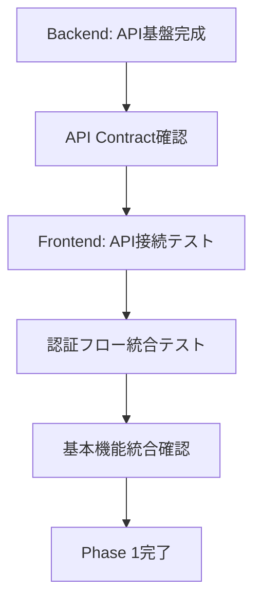
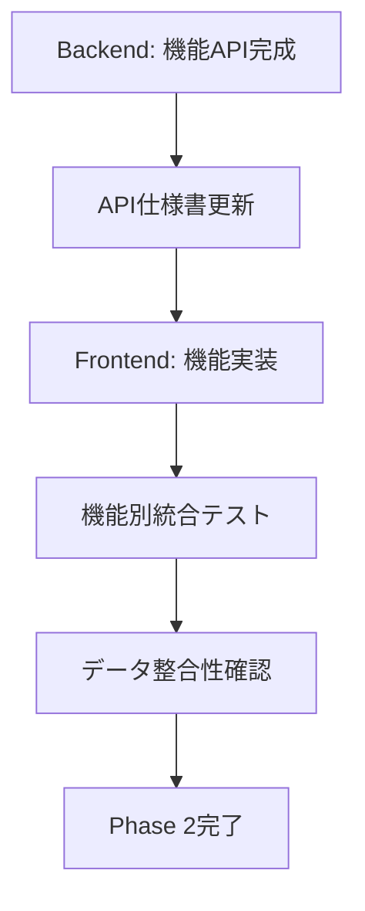
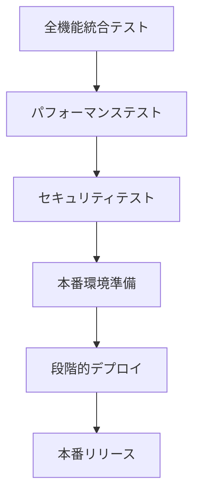

# 統合・デプロイガイド

🚀 **開発チーム間の統合テスト・デプロイ協調手順**

## 🎯 概要

このガイドは、バックエンド（手動開発）とフロントエンド（Claude Code）間の統合作業、テスト、デプロイメントプロセスを定義します。

## 📋 統合フロー

### Phase 1: 基盤統合（2-3日）


### Phase 2: 機能統合（3-5日）


### Phase 3: 最終統合・デプロイ（2-3日）


## 🔧 開発環境構成

### ローカル開発環境
```yaml
# docker-compose.dev.yml
version: '3.8'
services:
  db:
    image: mcr.microsoft.com/mssql/server:2022-latest
    environment:
      SA_PASSWORD: "Dev_Password123!"
      ACCEPT_EULA: "Y"
      MSSQL_DB: MessageDB
    ports:
      - "1433:1433"
    volumes:
      - mssql_data:/var/opt/mssql

  api:
    build: ./api
    ports:
      - "5000:80"
    environment:
      - ConnectionStrings__DefaultConnection=Server=db,1433;Database=MessageDB;User Id=sa;Password=Dev_Password123!;TrustServerCertificate=true;MultipleActiveResultSets=true
      - ASPNETCORE_ENVIRONMENT=Development
    depends_on:
      - db
    volumes:
      - ./api:/app

  frontend:
    build: ./frontend
    ports:
      - "3000:3000"
    environment:
      - NUXT_PUBLIC_API_BASE_URL=http://localhost:5000/api
    volumes:
      - ./frontend:/app
    command: npm run dev

volumes:
  mssql_data:
```

### 環境別設定
| 環境 | API URL | Frontend URL | Database |
|------|---------|--------------|----------|
| Development | http://localhost:5000 | http://localhost:3000 | Local SQL Server |
| Staging | https://api-staging.message-app.com | https://staging.message-app.com | Staging SQL Server |
| Production | https://api.message-app.com | https://message-app.com | Production SQL Server |

## 🧪 統合テスト戦略

### 1. API統合テスト

#### テスト環境セットアップ
```bash
# Backend テスト環境
cd api
dotnet test --configuration Release --logger trx

# Frontend テスト環境
cd frontend
npm run test:integration
```

#### テストシナリオ
```typescript
// tests/integration/auth.test.ts
describe('認証統合テスト', () => {
  test('ユーザー登録からログインまでの完全フロー', async () => {
    // 1. ユーザー登録
    const registerResponse = await api.post('/auth/register', {
      email: 'test@example.com',
      password: 'password123',
      displayName: 'テストユーザー'
    })
    
    expect(registerResponse.status).toBe(201)
    expect(registerResponse.data.success).toBe(true)
    
    // 2. ログイン
    const loginResponse = await api.post('/auth/login', {
      email: 'test@example.com',
      password: 'password123'
    })
    
    expect(loginResponse.status).toBe(200)
    expect(loginResponse.data.data.accessToken).toBeDefined()
    
    // 3. 認証が必要なAPIアクセス
    const profileResponse = await api.get('/users/profile', {
      headers: {
        Authorization: `Bearer ${loginResponse.data.data.accessToken}`
      }
    })
    
    expect(profileResponse.status).toBe(200)
    expect(profileResponse.data.data.email).toBe('test@example.com')
  })
})
```

### 2. E2E テスト

#### Playwright設定
```typescript
// tests/e2e/workout-flow.spec.ts
import { test, expect } from '@playwright/test'

test('トレーニング記録の完全フロー', async ({ page }) => {
  // 1. ログイン
  await page.goto('/login')
  await page.fill('[data-testid=email]', 'test@example.com')
  await page.fill('[data-testid=password]', 'password123')
  await page.click('[data-testid=login-button]')
  
  // 2. ダッシュボード確認
  await expect(page).toHaveURL('/dashboard')
  await expect(page.locator('[data-testid=welcome-message]')).toBeVisible()
  
  // 3. トレーニング記録画面へ
  await page.click('[data-testid=training-nav]')
  await expect(page).toHaveURL('/training')
  
  // 4. 新しい記録を作成
  await page.click('[data-testid=new-record-button]')
  await page.selectOption('[data-testid=menu-select]', 'bench-press')
  await page.fill('[data-testid=weight-input]', '70')
  await page.fill('[data-testid=reps-input]', '10')
  await page.click('[data-testid=save-button]')
  
  // 5. 記録が保存されたことを確認
  await expect(page.locator('[data-testid=success-message]')).toBeVisible()
  await expect(page.locator('[data-testid=record-list]')).toContainText('ベンチプレス')
})
```

### 3. パフォーマンステスト

#### Load Testing (K6)
```javascript
// tests/performance/load-test.js
import http from 'k6/http'
import { check, sleep } from 'k6'

export let options = {
  stages: [
    { duration: '2m', target: 100 }, // 2分で100ユーザーまで増加
    { duration: '5m', target: 100 }, // 5分間100ユーザーを維持
    { duration: '2m', target: 200 }, // 2分で200ユーザーまで増加
    { duration: '5m', target: 200 }, // 5分間200ユーザーを維持
    { duration: '2m', target: 0 },   // 2分で0まで減少
  ],
}

export default function() {
  // ログイン
  const loginRes = http.post('https://api.message-app.com/api/auth/login', {
    email: 'test@example.com',
    password: 'password123'
  })
  
  check(loginRes, {
    'ログイン成功': (r) => r.status === 200,
    'レスポンス時間 < 500ms': (r) => r.timings.duration < 500,
  })
  
  const token = loginRes.json('data.accessToken')
  
  // API呼び出し
  const headers = { Authorization: `Bearer ${token}` }
  
  const trainingRes = http.get('https://api.message-app.com/api/training/records', { headers })
  check(trainingRes, {
    'トレーニング取得成功': (r) => r.status === 200,
    'レスポンス時間 < 1000ms': (r) => r.timings.duration < 1000,
  })
  
  sleep(1)
}
```

## 🔄 CI/CD パイプライン

### GitHub Actions設定

#### Backend CI/CD
```yaml
# .github/workflows/api-deploy.yml
name: API Deploy

on:
  push:
    branches: [main]
    paths: ['api/**']
  pull_request:
    branches: [main]
    paths: ['api/**']

jobs:
  test:
    runs-on: ubuntu-latest
    
    services:
      sqlserver:
        image: mcr.microsoft.com/mssql/server:2022-latest
        env:
          SA_PASSWORD: Test_Password123!
          ACCEPT_EULA: Y
        options: >-
          --health-cmd "/opt/mssql-tools/bin/sqlcmd -S localhost -U sa -P Test_Password123! -Q 'SELECT 1'"
          --health-interval 10s
          --health-timeout 5s
          --health-retries 5
        ports:
          - 1433:1433

    steps:
    - uses: actions/checkout@v3
    
    - name: Setup .NET
      uses: actions/setup-dotnet@v3
      with:
        dotnet-version: 8.0.x
        
    - name: Restore dependencies
      run: dotnet restore api/
      
    - name: Build
      run: dotnet build api/ --no-restore
      
    - name: Test
      run: dotnet test api/ --no-build --verbosity normal
      
    - name: Run migrations
      run: dotnet ef database update -p api/
      env:
        ConnectionStrings__DefaultConnection: Server=localhost,1433;Database=testdb;User Id=sa;Password=Test_Password123!;TrustServerCertificate=true;MultipleActiveResultSets=true

  deploy-staging:
    if: github.event_name == 'pull_request'
    needs: test
    runs-on: ubuntu-latest
    
    steps:
    - uses: actions/checkout@v3
    
    - name: Deploy to Staging
      run: |
        echo "Deploying to staging environment"
        # デプロイコマンド

  deploy-production:
    if: github.ref == 'refs/heads/main'
    needs: test
    runs-on: ubuntu-latest
    
    steps:
    - uses: actions/checkout@v3
    
    - name: Deploy to Production
      run: |
        echo "Deploying to production environment"
        # デプロイコマンド
```

#### Frontend CI/CD
```yaml
# .github/workflows/frontend-deploy.yml
name: Frontend Deploy

on:
  push:
    branches: [main]
    paths: ['frontend/**']
  pull_request:
    branches: [main]
    paths: ['frontend/**']

jobs:
  test:
    runs-on: ubuntu-latest
    
    steps:
    - uses: actions/checkout@v3
    
    - name: Setup Node.js
      uses: actions/setup-node@v3
      with:
        node-version: '18'
        cache: 'npm'
        cache-dependency-path: frontend/package-lock.json
        
    - name: Install dependencies
      run: npm ci
      working-directory: frontend/
      
    - name: Lint
      run: npm run lint
      working-directory: frontend/
      
    - name: Type check
      run: npm run typecheck
      working-directory: frontend/
      
    - name: Unit tests
      run: npm run test:unit
      working-directory: frontend/
      
    - name: E2E tests
      run: npm run test:e2e
      working-directory: frontend/
      env:
        API_BASE_URL: http://localhost:5000/api

  build:
    needs: test
    runs-on: ubuntu-latest
    
    steps:
    - uses: actions/checkout@v3
    
    - name: Setup Node.js
      uses: actions/setup-node@v3
      with:
        node-version: '18'
        cache: 'npm'
        cache-dependency-path: frontend/package-lock.json
        
    - name: Install dependencies
      run: npm ci
      working-directory: frontend/
      
    - name: Build
      run: npm run build
      working-directory: frontend/
      env:
        NUXT_PUBLIC_API_BASE_URL: https://api.message-app.com/api
        
    - name: Upload artifacts
      uses: actions/upload-artifact@v3
      with:
        name: frontend-build
        path: frontend/.output/

  deploy-staging:
    if: github.event_name == 'pull_request'
    needs: build
    runs-on: ubuntu-latest
    
    steps:
    - name: Download artifacts
      uses: actions/download-artifact@v3
      with:
        name: frontend-build
        
    - name: Deploy to Staging
      run: |
        echo "Deploying frontend to staging"
        # デプロイコマンド

  deploy-production:
    if: github.ref == 'refs/heads/main'
    needs: build
    runs-on: ubuntu-latest
    
    steps:
    - name: Download artifacts
      uses: actions/download-artifact@v3
      with:
        name: frontend-build
        
    - name: Deploy to Production
      run: |
        echo "Deploying frontend to production"
        # デプロイコマンド
```

## 📊 監視・ログ

### アプリケーション監視

#### Backend監視 (Serilog + Seq)
```csharp
// Program.cs
builder.Host.UseSerilog((context, configuration) =>
    configuration
        .ReadFrom.Configuration(context.Configuration)
        .Enrich.FromLogContext()
        .WriteTo.Console()
        .WriteTo.File("logs/app-.txt", rollingInterval: RollingInterval.Day)
        .WriteTo.MSSqlServer(
            connectionString: context.Configuration.GetConnectionString("DefaultConnection"),
            sinkOptions: new MSSqlServerSinkOptions { TableName = "Logs", AutoCreateSqlTable = true })
        .WriteTo.Seq("http://seq:5341"));

// Middleware/RequestLoggingMiddleware.cs
public class RequestLoggingMiddleware
{
    private readonly RequestDelegate _next;
    private readonly ILogger<RequestLoggingMiddleware> _logger;

    public async Task InvokeAsync(HttpContext context)
    {
        var stopwatch = Stopwatch.StartNew();
        
        _logger.LogInformation("Request {Method} {Path} started", 
            context.Request.Method, context.Request.Path);

        await _next(context);

        stopwatch.Stop();
        
        _logger.LogInformation("Request {Method} {Path} completed in {ElapsedMs}ms with status {StatusCode}",
            context.Request.Method, 
            context.Request.Path, 
            stopwatch.ElapsedMilliseconds,
            context.Response.StatusCode);
    }
}
```

#### Frontend監視 (Sentry)
```typescript
// plugins/sentry.client.ts
import * as Sentry from '@sentry/vue'

export default defineNuxtPlugin((nuxtApp) => {
  const config = useRuntimeConfig()
  
  if (config.public.sentryDsn) {
    Sentry.init({
      app: nuxtApp.vueApp,
      dsn: config.public.sentryDsn,
      environment: config.public.environment,
      integrations: [
        new Sentry.BrowserTracing({
          routingInstrumentation: Sentry.vueRouterInstrumentation(nuxtApp.$router)
        })
      ],
      tracesSampleRate: 1.0
    })
  }
})
```

### ヘルスチェック設定

#### Backend
```csharp
// Program.cs
builder.Services.AddHealthChecks()
    .AddSqlServer(builder.Configuration.GetConnectionString("DefaultConnection"))
    .AddCheck("self", () => HealthCheckResult.Healthy());

app.MapHealthChecks("/health", new HealthCheckOptions
{
    ResponseWriter = UIResponseWriter.WriteHealthCheckUIResponse
});
```

#### Frontend
```typescript
// server/api/health.ts
export default defineEventHandler(async (event) => {
  try {
    // APIサーバーのヘルスチェック
    const apiHealth = await $fetch('/health', {
      baseURL: useRuntimeConfig().public.apiBaseUrl
    })
    
    return {
      status: 'healthy',
      timestamp: new Date().toISOString(),
      services: {
        api: apiHealth.status,
        frontend: 'healthy'
      }
    }
  } catch (error) {
    throw createError({
      statusCode: 503,
      statusMessage: 'Service Unavailable'
    })
  }
})
```

## 🚀 デプロイメント戦略

### Blue-Green デプロイメント

#### インフラ構成
```yaml
# docker-compose.prod.yml
version: '3.8'
services:
  nginx:
    image: nginx:alpine
    ports:
      - "80:80"
      - "443:443"
    volumes:
      - ./nginx/nginx.conf:/etc/nginx/nginx.conf
      - ./ssl:/etc/ssl/certs
    depends_on:
      - api-blue
      - api-green
      - frontend-blue
      - frontend-green

  api-blue:
    image: message-api:${API_VERSION_BLUE}
    environment:
      - ASPNETCORE_ENVIRONMENT=Production
      - ConnectionStrings__DefaultConnection=${DB_CONNECTION_STRING}
    
  api-green:
    image: message-api:${API_VERSION_GREEN}
    environment:
      - ASPNETCORE_ENVIRONMENT=Production
      - ConnectionStrings__DefaultConnection=${DB_CONNECTION_STRING}
    
  frontend-blue:
    image: message-frontend:${FRONTEND_VERSION_BLUE}
    environment:
      - NUXT_PUBLIC_API_BASE_URL=https://api.message-app.com/api
    
  frontend-green:
    image: message-frontend:${FRONTEND_VERSION_GREEN}
    environment:
      - NUXT_PUBLIC_API_BASE_URL=https://api.message-app.com/api

  db:
    image: mcr.microsoft.com/mssql/server:2022-latest
    environment:
      - SA_PASSWORD=${DB_PASSWORD}
      - ACCEPT_EULA=Y
      - MSSQL_DB=${DB_NAME}
    volumes:
      - mssql_data:/var/opt/mssql
```

#### デプロイスクリプト
```bash
#!/bin/bash
# scripts/deploy.sh

set -e

ENVIRONMENT=${1:-staging}
API_VERSION=${2}
FRONTEND_VERSION=${3}

echo "Deploying to $ENVIRONMENT environment"
echo "API Version: $API_VERSION"
echo "Frontend Version: $FRONTEND_VERSION"

# 現在のアクティブ環境を確認
CURRENT_ACTIVE=$(curl -s https://api.message-app.com/health | jq -r '.environment')

if [ "$CURRENT_ACTIVE" = "blue" ]; then
    TARGET_ENV="green"
else
    TARGET_ENV="blue"
fi

echo "Deploying to $TARGET_ENV environment"

# 新しいバージョンをデプロイ
export API_VERSION_${TARGET_ENV^^}=$API_VERSION
export FRONTEND_VERSION_${TARGET_ENV^^}=$FRONTEND_VERSION

docker-compose -f docker-compose.prod.yml up -d api-$TARGET_ENV frontend-$TARGET_ENV

# ヘルスチェック
echo "Waiting for services to be healthy..."
sleep 30

# スモークテスト
echo "Running smoke tests..."
if npm run test:smoke -- --env=$TARGET_ENV; then
    echo "Smoke tests passed. Switching traffic..."
    
    # トラフィック切り替え
    ./scripts/switch-traffic.sh $TARGET_ENV
    
    echo "Deployment completed successfully!"
    
    # 古い環境をクリーンアップ
    sleep 60
    OLD_ENV=$([ "$TARGET_ENV" = "blue" ] && echo "green" || echo "blue")
    docker-compose -f docker-compose.prod.yml stop api-$OLD_ENV frontend-$OLD_ENV
    
else
    echo "Smoke tests failed. Rolling back..."
    docker-compose -f docker-compose.prod.yml stop api-$TARGET_ENV frontend-$TARGET_ENV
    exit 1
fi
```

### ロールバック手順
```bash
#!/bin/bash
# scripts/rollback.sh

PREVIOUS_VERSION=${1}

echo "Rolling back to version: $PREVIOUS_VERSION"

# 現在のアクティブ環境を確認
CURRENT_ACTIVE=$(curl -s https://api.message-app.com/health | jq -r '.environment')
TARGET_ENV=$([ "$CURRENT_ACTIVE" = "blue" ] && echo "green" || echo "blue")

# 前のバージョンを起動
export API_VERSION_${TARGET_ENV^^}=$PREVIOUS_VERSION
export FRONTEND_VERSION_${TARGET_ENV^^}=$PREVIOUS_VERSION

docker-compose -f docker-compose.prod.yml up -d api-$TARGET_ENV frontend-$TARGET_ENV

# ヘルスチェック
sleep 30

# スモークテスト
if npm run test:smoke -- --env=$TARGET_ENV; then
    # トラフィック切り替え
    ./scripts/switch-traffic.sh $TARGET_ENV
    echo "Rollback completed successfully!"
else
    echo "Rollback failed!"
    exit 1
fi
```

## 📋 チェックリスト

### 統合テスト前
- [ ] API仕様書が最新
- [ ] 開発環境でのAPI動作確認
- [ ] Frontend環境設定完了
- [ ] テストデータ準備
- [ ] ログ・監視設定確認

### 統合テスト中
- [ ] 認証フローテスト
- [ ] 主要機能のE2Eテスト
- [ ] エラーハンドリングテスト
- [ ] パフォーマンステスト
- [ ] セキュリティテスト

### デプロイ前
- [ ] 全テスト合格
- [ ] 本番環境設定確認
- [ ] バックアップ作成
- [ ] ロールバック計画確認
- [ ] 監視アラート設定

### デプロイ後
- [ ] ヘルスチェック確認
- [ ] スモークテスト実行
- [ ] ログ・メトリクス確認
- [ ] ユーザー動作確認
- [ ] パフォーマンス監視

## 🔧 トラブルシューティング

### よくある問題と解決方法

#### 1. API接続エラー
```bash
# CORS設定確認
curl -H "Origin: http://localhost:3000" \
     -H "Access-Control-Request-Method: POST" \
     -H "Access-Control-Request-Headers: Authorization" \
     -X OPTIONS \
     http://localhost:5000/api/auth/login

# 接続確認
curl -v http://localhost:5000/health
```

#### 2. 認証エラー
```bash
# JWT トークンの検証
echo "eyJhbGciOiJIUzI1NiIsInR5cCI6IkpXVCJ9..." | base64 -d

# トークンの有効期限確認
curl -H "Authorization: Bearer TOKEN" \
     http://localhost:5000/api/users/profile
```

#### 3. データベース接続エラー
```bash
# SQL Server接続確認
sqlcmd -S localhost -U sa -P "password" -Q "SELECT @@VERSION"

# マイグレーション状態確認
dotnet ef migrations list -p api/
```

### ログ分析

#### 重要なログパターン
```
# APIエラー
ERROR - Request failed: {Method} {Path} - {Error}

# パフォーマンス
WARN - Slow request: {Method} {Path} took {Duration}ms

# セキュリティ
WARN - Failed login attempt from {IP} for user {Email}
```

## 📞 エスカレーション

### 問題発生時の連絡体制
1. **Level 1**: 開発チーム内で解決（30分以内）
2. **Level 2**: チーム間連携（1時間以内）
3. **Level 3**: マネジメント報告（2時間以内）

### 緊急時対応
- 即座にロールバック実行
- 影響範囲の確認・報告
- 根本原因分析・対策立案

---

## 🤝 成功のための協調ポイント

1. **定期的なコミュニケーション**: 週2回の進捗共有
2. **早期統合**: 機能完成と同時に統合テスト
3. **継続的監視**: メトリクス・ログの共有
4. **迅速な問題解決**: 問題発生時の迅速な対応

**🚀 チーム一丸となって、高品質なシステムの構築を成功させましょう！**