# Message システムシーケンス図

## 1. 認証関連フロー

### 1.1 ユーザー登録フロー

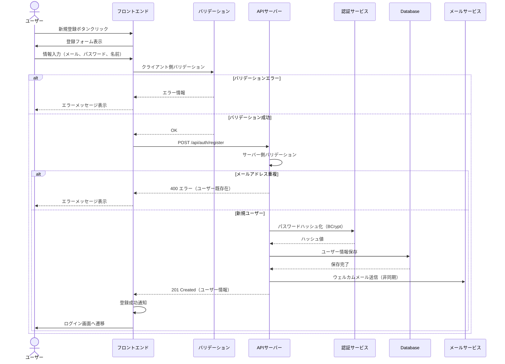
```mermaid
sequenceDiagram
    actor User as ユーザー
    participant UI as フロントエンド
    participant Val as バリデーション
    participant API as APIサーバー
    participant Auth as 認証サービス
    participant DB as Database
    participant Email as メールサービス

    User->>UI: 新規登録ボタンクリック
    UI->>User: 登録フォーム表示
    User->>UI: 情報入力（メール、パスワード、名前）
    UI->>Val: クライアント側バリデーション
    
    alt バリデーションエラー
        Val-->>UI: エラー情報
        UI-->>User: エラーメッセージ表示
    else バリデーション成功
        Val-->>UI: OK
        UI->>API: POST /api/auth/register
        API->>API: サーバー側バリデーション
        
        alt メールアドレス重複
            API-->>UI: 400 エラー（ユーザー既存在）
            UI-->>User: エラーメッセージ表示
        else 新規ユーザー
            API->>Auth: パスワードハッシュ化（BCrypt）
            Auth-->>API: ハッシュ値
            API->>DB: ユーザー情報保存
            DB-->>API: 保存完了
            API->>Email: ウェルカムメール送信（非同期）
            API-->>UI: 201 Created（ユーザー情報）
            UI->>UI: 登録成功通知
            UI->>User: ログイン画面へ遷移
        end
    end
```

### 1.2 ログイン・トークン管理フロー

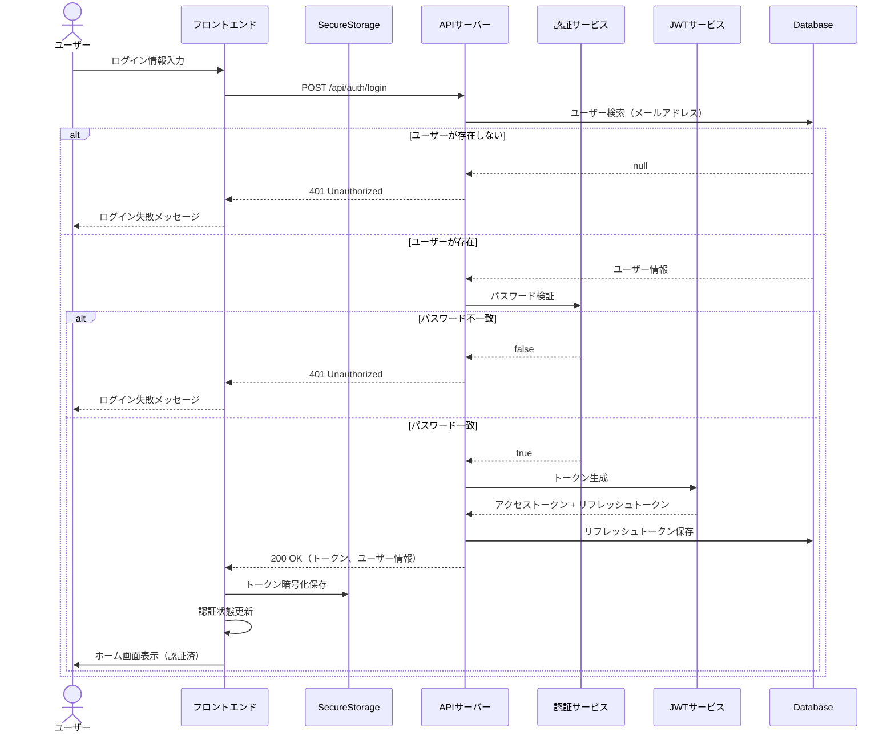
```mermaid
sequenceDiagram
    actor User as ユーザー
    participant UI as フロントエンド
    participant SS as SecureStorage
    participant API as APIサーバー
    participant Auth as 認証サービス
    participant JWT as JWTサービス
    participant DB as Database

    User->>UI: ログイン情報入力
    UI->>API: POST /api/auth/login
    API->>DB: ユーザー検索（メールアドレス）
    
    alt ユーザーが存在しない
        DB-->>API: null
        API-->>UI: 401 Unauthorized
        UI-->>User: ログイン失敗メッセージ
    else ユーザーが存在
        DB-->>API: ユーザー情報
        API->>Auth: パスワード検証
        
        alt パスワード不一致
            Auth-->>API: false
            API-->>UI: 401 Unauthorized
            UI-->>User: ログイン失敗メッセージ
        else パスワード一致
            Auth-->>API: true
            API->>JWT: トークン生成
            JWT-->>API: アクセストークン + リフレッシュトークン
            API->>DB: リフレッシュトークン保存
            API-->>UI: 200 OK（トークン、ユーザー情報）
            UI->>SS: トークン暗号化保存
            UI->>UI: 認証状態更新
            UI->>User: ホーム画面表示（認証済）
        end
    end
```

### 1.3 トークン自動更新フロー

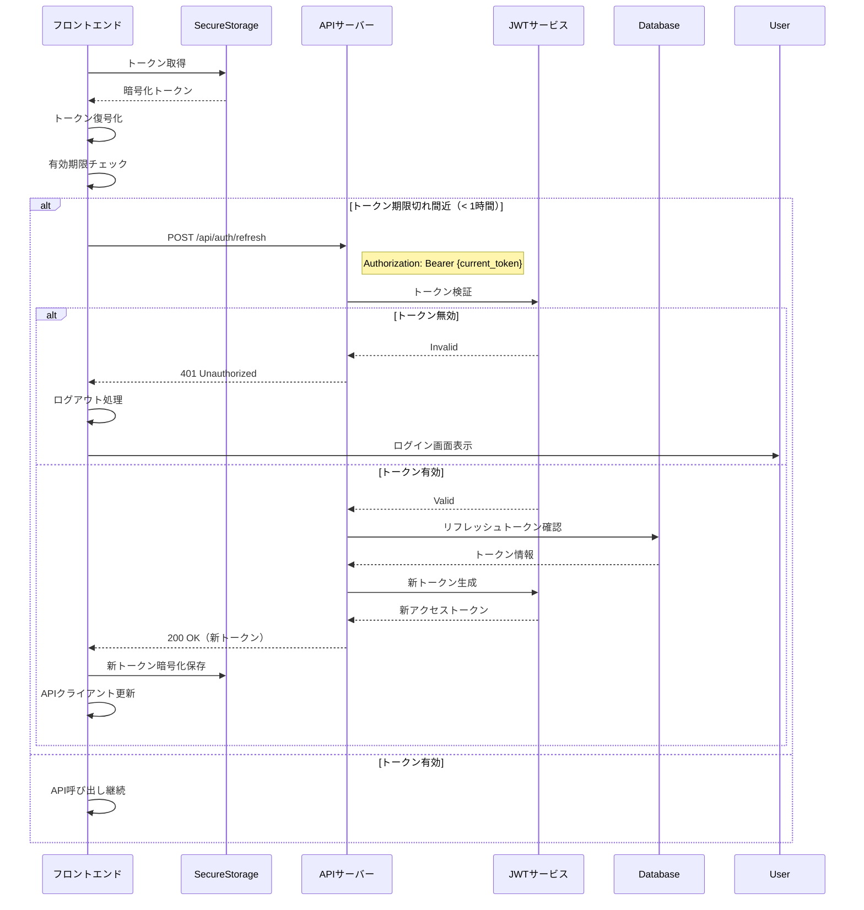
```mermaid
sequenceDiagram
    participant UI as フロントエンド
    participant SS as SecureStorage
    participant API as APIサーバー
    participant JWT as JWTサービス
    participant DB as Database

    UI->>SS: トークン取得
    SS-->>UI: 暗号化トークン
    UI->>UI: トークン復号化
    UI->>UI: 有効期限チェック
    
    alt トークン期限切れ間近（< 1時間）
        UI->>API: POST /api/auth/refresh
        Note right of API: Authorization: Bearer {current_token}
        API->>JWT: トークン検証
        
        alt トークン無効
            JWT-->>API: Invalid
            API-->>UI: 401 Unauthorized
            UI->>UI: ログアウト処理
            UI->>User: ログイン画面表示
        else トークン有効
            JWT-->>API: Valid
            API->>DB: リフレッシュトークン確認
            DB-->>API: トークン情報
            API->>JWT: 新トークン生成
            JWT-->>API: 新アクセストークン
            API-->>UI: 200 OK（新トークン）
            UI->>SS: 新トークン暗号化保存
            UI->>UI: APIクライアント更新
        end
    else トークン有効
        UI->>UI: API呼び出し継続
    end
```

## 2. トレーニング記録フロー

### 2.1 ワークアウトセッション開始フロー

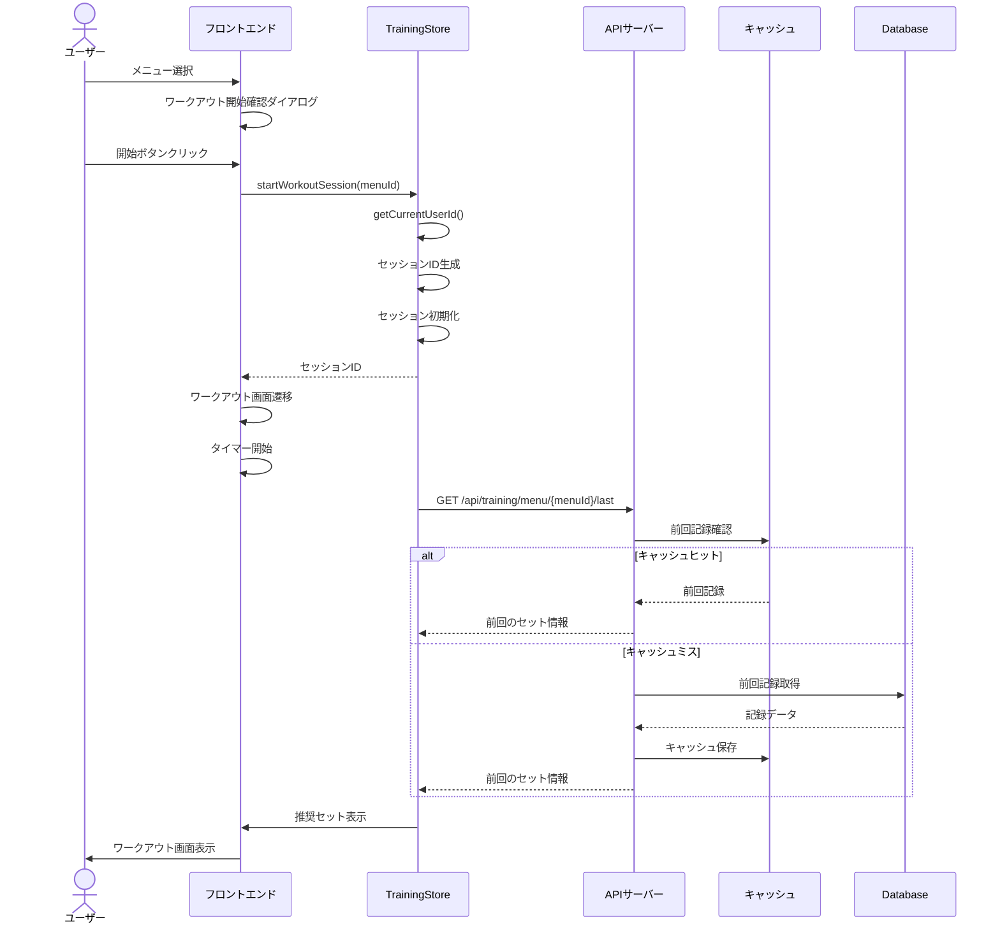
```mermaid
sequenceDiagram
    actor User as ユーザー
    participant UI as フロントエンド
    participant Store as TrainingStore
    participant API as APIサーバー
    participant Cache as キャッシュ
    participant DB as Database

    User->>UI: メニュー選択
    UI->>UI: ワークアウト開始確認ダイアログ
    User->>UI: 開始ボタンクリック
    
    UI->>Store: startWorkoutSession(menuId)
    Store->>Store: getCurrentUserId()
    Store->>Store: セッションID生成
    Store->>Store: セッション初期化
    
    Store-->>UI: セッションID
    UI->>UI: ワークアウト画面遷移
    UI->>UI: タイマー開始
    
    Store->>API: GET /api/training/menu/{menuId}/last
    API->>Cache: 前回記録確認
    
    alt キャッシュヒット
        Cache-->>API: 前回記録
        API-->>Store: 前回のセット情報
    else キャッシュミス
        API->>DB: 前回記録取得
        DB-->>API: 記録データ
        API->>Cache: キャッシュ保存
        API-->>Store: 前回のセット情報
    end
    
    Store->>UI: 推奨セット表示
    UI->>User: ワークアウト画面表示
```

### 2.2 セット記録・保存フロー

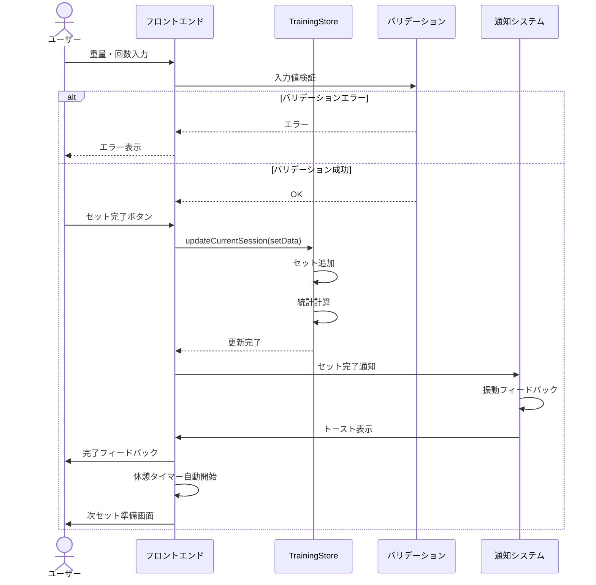
```mermaid
sequenceDiagram
    actor User as ユーザー
    participant UI as フロントエンド
    participant Store as TrainingStore
    participant Val as バリデーション
    participant Notif as 通知システム

    User->>UI: 重量・回数入力
    UI->>Val: 入力値検証
    
    alt バリデーションエラー
        Val-->>UI: エラー
        UI-->>User: エラー表示
    else バリデーション成功
        Val-->>UI: OK
        User->>UI: セット完了ボタン
        UI->>Store: updateCurrentSession(setData)
        Store->>Store: セット追加
        Store->>Store: 統計計算
        Store-->>UI: 更新完了
        
        UI->>Notif: セット完了通知
        Notif->>Notif: 振動フィードバック
        Notif->>UI: トースト表示
        UI->>User: 完了フィードバック
        
        UI->>UI: 休憩タイマー自動開始
        UI->>User: 次セット準備画面
    end
```

### 2.3 セッション完了・データ同期フロー

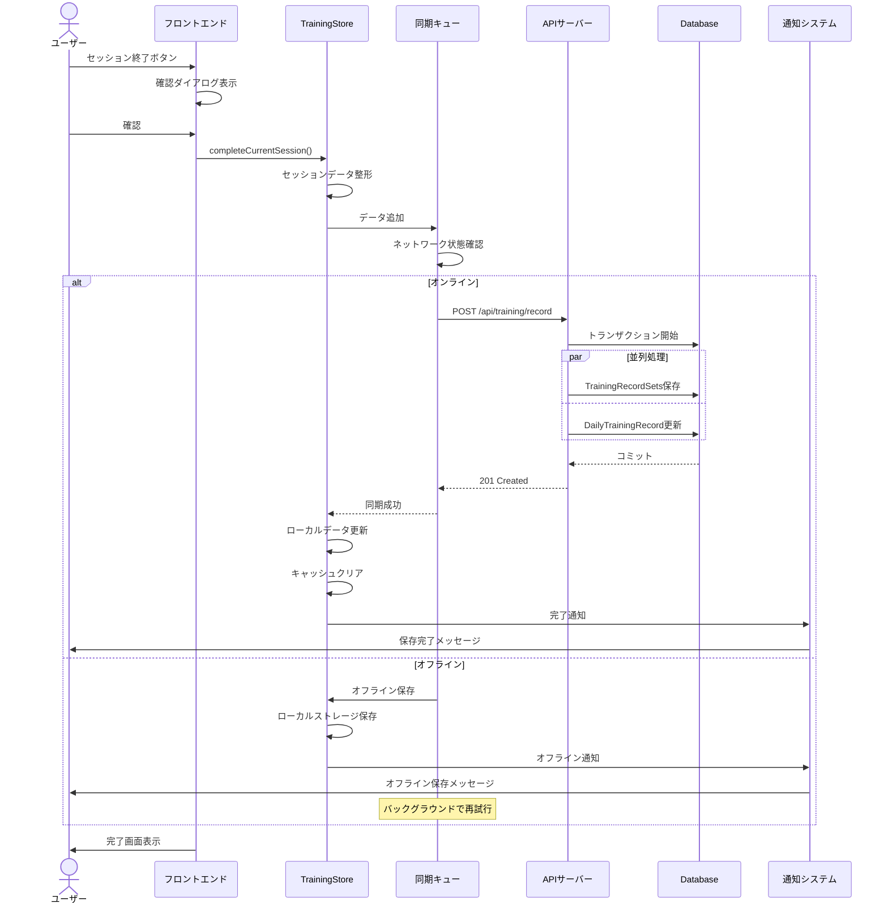
```mermaid
sequenceDiagram
    actor User as ユーザー
    participant UI as フロントエンド
    participant Store as TrainingStore
    participant Queue as 同期キュー
    participant API as APIサーバー
    participant DB as Database
    participant Notif as 通知システム

    User->>UI: セッション終了ボタン
    UI->>UI: 確認ダイアログ表示
    User->>UI: 確認
    
    UI->>Store: completeCurrentSession()
    Store->>Store: セッションデータ整形
    
    Store->>Queue: データ追加
    Queue->>Queue: ネットワーク状態確認
    
    alt オンライン
        Queue->>API: POST /api/training/record
        API->>DB: トランザクション開始
        
        par 並列処理
            API->>DB: TrainingRecordSets保存
        and
            API->>DB: DailyTrainingRecord更新
        end
        
        DB-->>API: コミット
        API-->>Queue: 201 Created
        Queue-->>Store: 同期成功
        
        Store->>Store: ローカルデータ更新
        Store->>Store: キャッシュクリア
        Store->>Notif: 完了通知
        Notif->>User: 保存完了メッセージ
        
    else オフライン
        Queue->>Store: オフライン保存
        Store->>Store: ローカルストレージ保存
        Store->>Notif: オフライン通知
        Notif->>User: オフライン保存メッセージ
        
        Note over Queue: バックグラウンドで再試行
    end
    
    UI->>User: 完了画面表示
```

## 3. データ取得・表示フロー

### 3.1 トレーニング履歴取得フロー

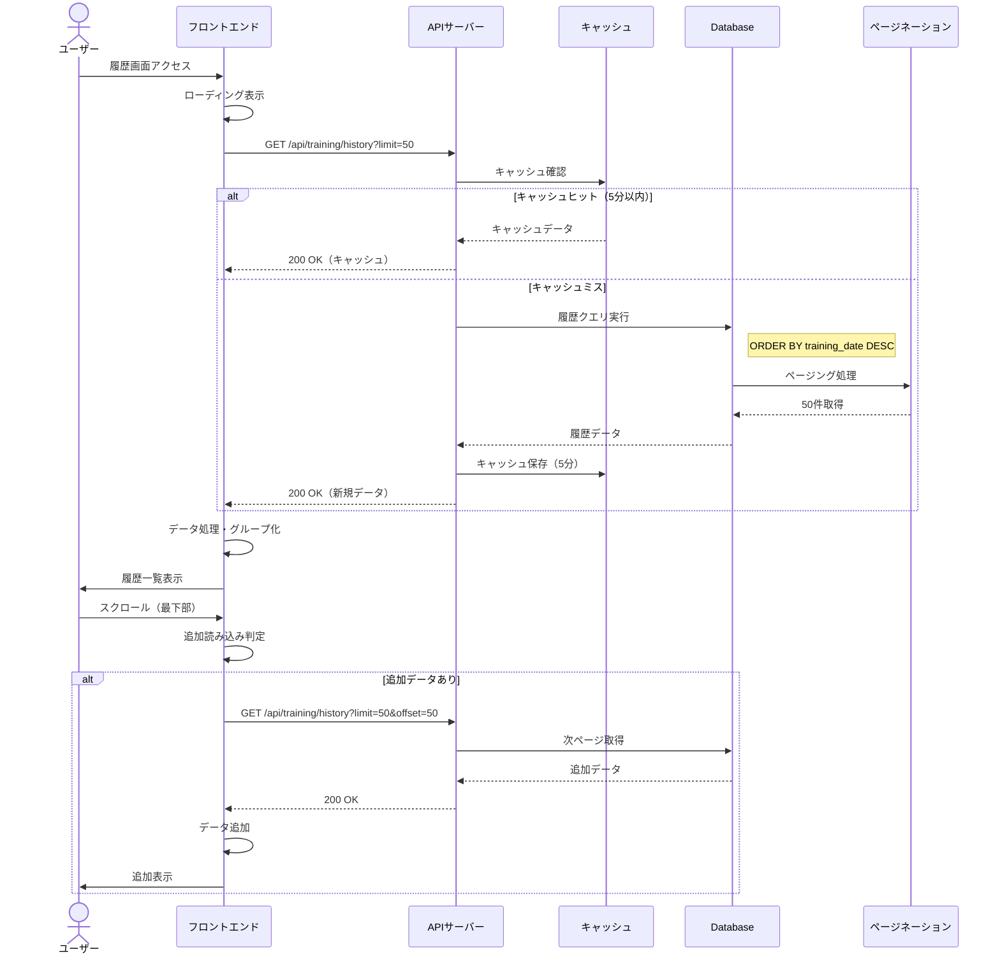
```mermaid
sequenceDiagram
    actor User as ユーザー
    participant UI as フロントエンド
    participant API as APIサーバー
    participant Cache as キャッシュ
    participant DB as Database
    participant Paginate as ページネーション

    User->>UI: 履歴画面アクセス
    UI->>UI: ローディング表示
    
    UI->>API: GET /api/training/history?limit=50
    API->>Cache: キャッシュ確認
    
    alt キャッシュヒット（5分以内）
        Cache-->>API: キャッシュデータ
        API-->>UI: 200 OK（キャッシュ）
    else キャッシュミス
        API->>DB: 履歴クエリ実行
        Note right of DB: ORDER BY training_date DESC
        DB->>Paginate: ページング処理
        Paginate-->>DB: 50件取得
        DB-->>API: 履歴データ
        API->>Cache: キャッシュ保存（5分）
        API-->>UI: 200 OK（新規データ）
    end
    
    UI->>UI: データ処理・グループ化
    UI->>User: 履歴一覧表示
    
    User->>UI: スクロール（最下部）
    UI->>UI: 追加読み込み判定
    
    alt 追加データあり
        UI->>API: GET /api/training/history?limit=50&offset=50
        API->>DB: 次ページ取得
        DB-->>API: 追加データ
        API-->>UI: 200 OK
        UI->>UI: データ追加
        UI->>User: 追加表示
    end
```

### 3.2 ダッシュボード統計取得フロー

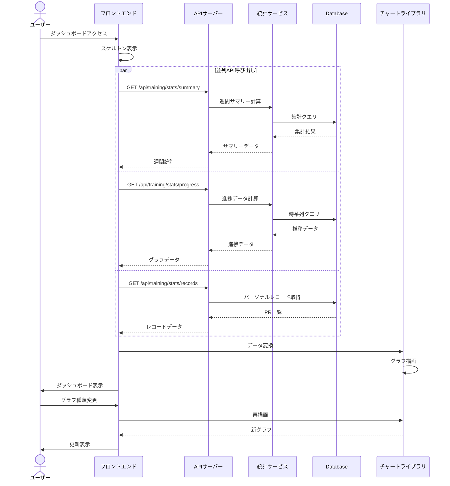
```mermaid
sequenceDiagram
    actor User as ユーザー
    participant UI as フロントエンド
    participant API as APIサーバー
    participant Stats as 統計サービス
    participant DB as Database
    participant Chart as チャートライブラリ

    User->>UI: ダッシュボードアクセス
    UI->>UI: スケルトン表示
    
    par 並列API呼び出し
        UI->>API: GET /api/training/stats/summary
        API->>Stats: 週間サマリー計算
        Stats->>DB: 集計クエリ
        DB-->>Stats: 集計結果
        Stats-->>API: サマリーデータ
        API-->>UI: 週間統計
    and
        UI->>API: GET /api/training/stats/progress
        API->>Stats: 進捗データ計算
        Stats->>DB: 時系列クエリ
        DB-->>Stats: 推移データ
        Stats-->>API: 進捗データ
        API-->>UI: グラフデータ
    and
        UI->>API: GET /api/training/stats/records
        API->>DB: パーソナルレコード取得
        DB-->>API: PR一覧
        API-->>UI: レコードデータ
    end
    
    UI->>Chart: データ変換
    Chart->>Chart: グラフ描画
    UI->>User: ダッシュボード表示
    
    User->>UI: グラフ種類変更
    UI->>Chart: 再描画
    Chart-->>UI: 新グラフ
    UI->>User: 更新表示
```

## 4. プリセット管理フロー

### 4.1 プリセット作成フロー

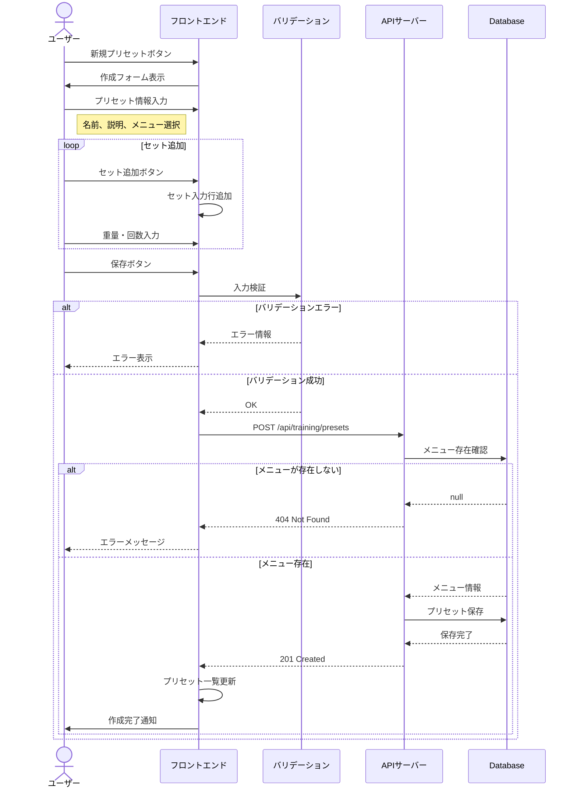
```mermaid
sequenceDiagram
    actor User as ユーザー
    participant UI as フロントエンド
    participant Val as バリデーション
    participant API as APIサーバー
    participant DB as Database

    User->>UI: 新規プリセットボタン
    UI->>User: 作成フォーム表示
    
    User->>UI: プリセット情報入力
    Note right of User: 名前、説明、メニュー選択
    
    loop セット追加
        User->>UI: セット追加ボタン
        UI->>UI: セット入力行追加
        User->>UI: 重量・回数入力
    end
    
    User->>UI: 保存ボタン
    UI->>Val: 入力検証
    
    alt バリデーションエラー
        Val-->>UI: エラー情報
        UI-->>User: エラー表示
    else バリデーション成功
        Val-->>UI: OK
        UI->>API: POST /api/training/presets
        
        API->>DB: メニュー存在確認
        alt メニューが存在しない
            DB-->>API: null
            API-->>UI: 404 Not Found
            UI-->>User: エラーメッセージ
        else メニュー存在
            DB-->>API: メニュー情報
            API->>DB: プリセット保存
            DB-->>API: 保存完了
            API-->>UI: 201 Created
            UI->>UI: プリセット一覧更新
            UI->>User: 作成完了通知
        end
    end
```

### 4.2 プリセット削除フロー（ローカル）

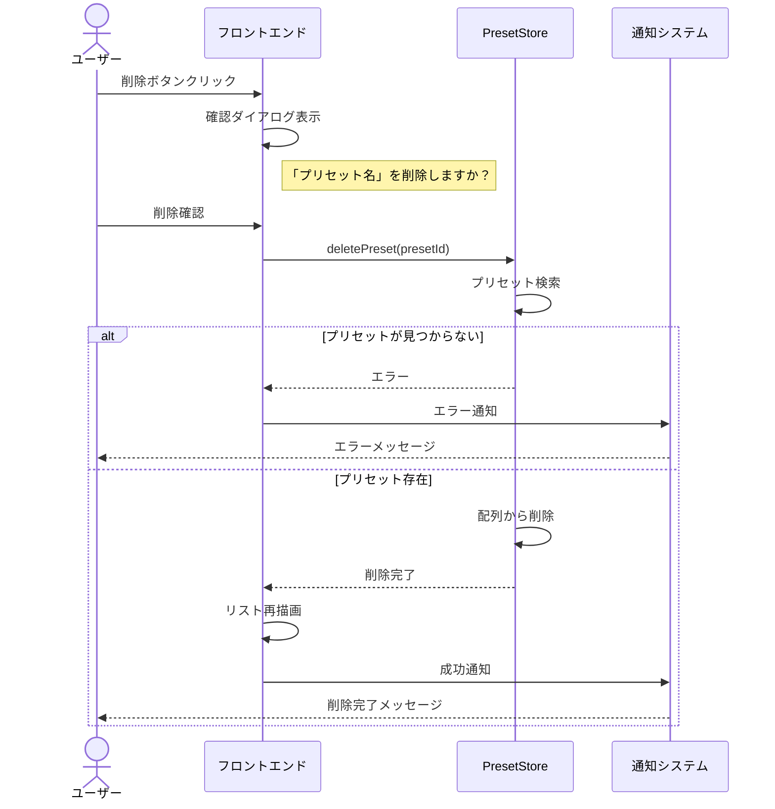
```mermaid
sequenceDiagram
    actor User as ユーザー
    participant UI as フロントエンド
    participant Store as PresetStore
    participant Notif as 通知システム

    User->>UI: 削除ボタンクリック
    UI->>UI: 確認ダイアログ表示
    Note right of UI: 「プリセット名」を削除しますか？
    
    User->>UI: 削除確認
    UI->>Store: deletePreset(presetId)
    Store->>Store: プリセット検索
    
    alt プリセットが見つからない
        Store-->>UI: エラー
        UI->>Notif: エラー通知
        Notif-->>User: エラーメッセージ
    else プリセット存在
        Store->>Store: 配列から削除
        Store-->>UI: 削除完了
        UI->>UI: リスト再描画
        UI->>Notif: 成功通知
        Notif-->>User: 削除完了メッセージ
    end
```

## 5. モバイルアプリ固有フロー

### 5.1 オフラインデータ永続化フロー

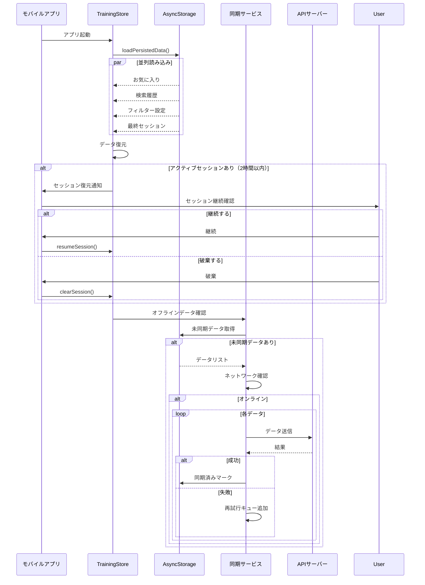
```mermaid
sequenceDiagram
    participant App as モバイルアプリ
    participant Store as TrainingStore
    participant AS as AsyncStorage
    participant Sync as 同期サービス
    participant API as APIサーバー

    App->>Store: アプリ起動
    Store->>AS: loadPersistedData()
    
    par 並列読み込み
        AS-->>Store: お気に入り
        AS-->>Store: 検索履歴
        AS-->>Store: フィルター設定
        AS-->>Store: 最終セッション
    end
    
    Store->>Store: データ復元
    
    alt アクティブセッションあり（2時間以内）
        Store->>App: セッション復元通知
        App->>User: セッション継続確認
        
        alt 継続する
            User->>App: 継続
            App->>Store: resumeSession()
        else 破棄する
            User->>App: 破棄
            App->>Store: clearSession()
        end
    end
    
    Store->>Sync: オフラインデータ確認
    Sync->>AS: 未同期データ取得
    
    alt 未同期データあり
        AS-->>Sync: データリスト
        Sync->>Sync: ネットワーク確認
        
        alt オンライン
            loop 各データ
                Sync->>API: データ送信
                API-->>Sync: 結果
                
                alt 成功
                    Sync->>AS: 同期済みマーク
                else 失敗
                    Sync->>Sync: 再試行キュー追加
                end
            end
        end
    end
```

### 5.2 プッシュ通知フロー

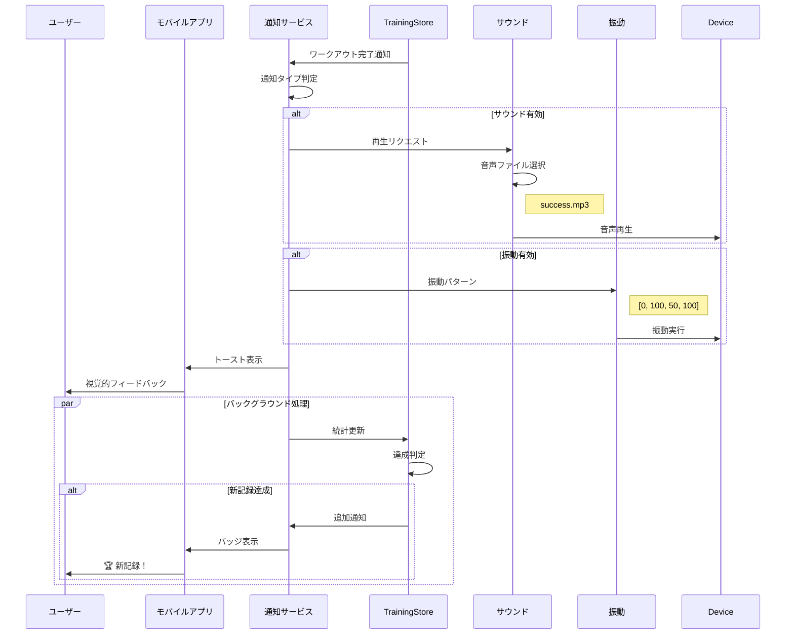
```mermaid
sequenceDiagram
    participant User as ユーザー
    participant App as モバイルアプリ
    participant Notif as 通知サービス
    participant Store as TrainingStore
    participant Sound as サウンド
    participant Vibrate as 振動

    Store->>Notif: ワークアウト完了通知
    Notif->>Notif: 通知タイプ判定
    
    alt サウンド有効
        Notif->>Sound: 再生リクエスト
        Sound->>Sound: 音声ファイル選択
        Note right of Sound: success.mp3
        Sound->>Device: 音声再生
    end
    
    alt 振動有効
        Notif->>Vibrate: 振動パターン
        Note right of Vibrate: [0, 100, 50, 100]
        Vibrate->>Device: 振動実行
    end
    
    Notif->>App: トースト表示
    App->>User: 視覚的フィードバック
    
    par バックグラウンド処理
        Notif->>Store: 統計更新
        Store->>Store: 達成判定
        
        alt 新記録達成
            Store->>Notif: 追加通知
            Notif->>App: バッジ表示
            App->>User: 🏆 新記録！
        end
    end
```

## 6. エラーハンドリングフロー

### 6.1 API エラーハンドリング

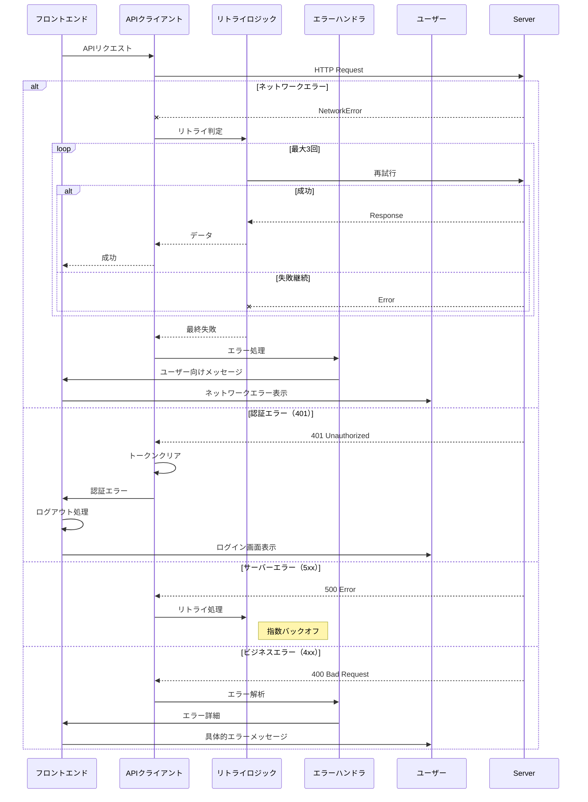
```mermaid
sequenceDiagram
    participant UI as フロントエンド
    participant API as APIクライアント
    participant Retry as リトライロジック
    participant Error as エラーハンドラ
    participant User as ユーザー

    UI->>API: APIリクエスト
    API->>Server: HTTP Request
    
    alt ネットワークエラー
        Server--xAPI: NetworkError
        API->>Retry: リトライ判定
        
        loop 最大3回
            Retry->>Server: 再試行
            alt 成功
                Server-->>Retry: Response
                Retry-->>API: データ
                API-->>UI: 成功
            else 失敗継続
                Server--xRetry: Error
            end
        end
        
        Retry-->>API: 最終失敗
        API->>Error: エラー処理
        Error->>UI: ユーザー向けメッセージ
        UI->>User: ネットワークエラー表示
        
    else 認証エラー（401）
        Server-->>API: 401 Unauthorized
        API->>API: トークンクリア
        API->>UI: 認証エラー
        UI->>UI: ログアウト処理
        UI->>User: ログイン画面表示
        
    else サーバーエラー（5xx）
        Server-->>API: 500 Error
        API->>Retry: リトライ処理
        Note right of Retry: 指数バックオフ
        
    else ビジネスエラー（4xx）
        Server-->>API: 400 Bad Request
        API->>Error: エラー解析
        Error->>UI: エラー詳細
        UI->>User: 具体的エラーメッセージ
    end
```

これらのシーケンス図は、Messageシステムの主要な業務フローを詳細に示しています。各フローは実際の実装に基づいており、エラーハンドリングやオフライン対応なども含まれています。