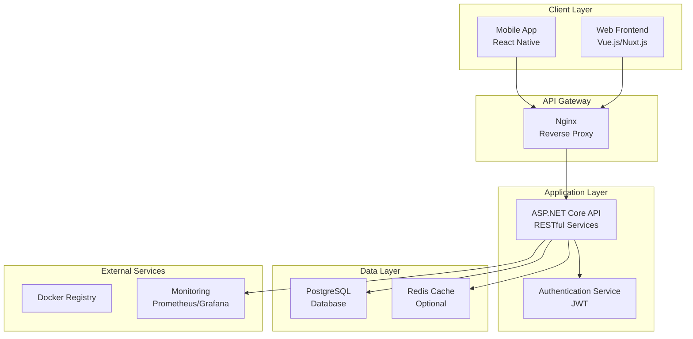
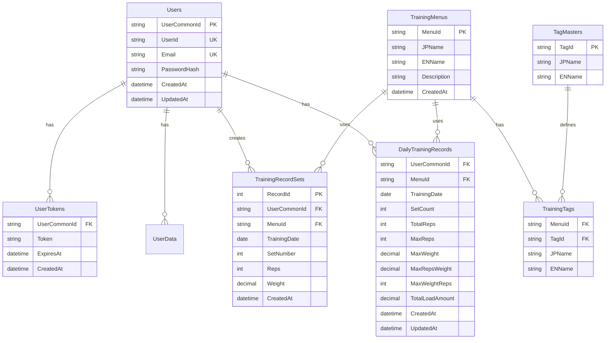
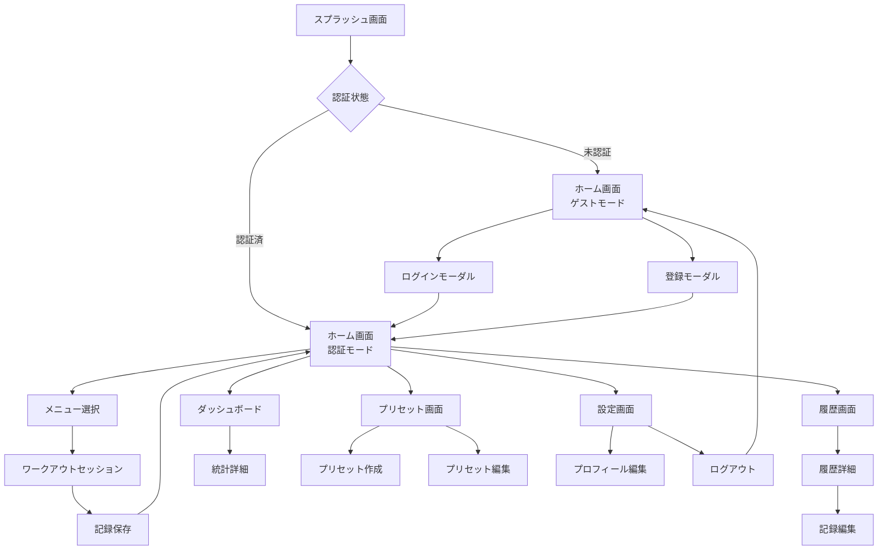
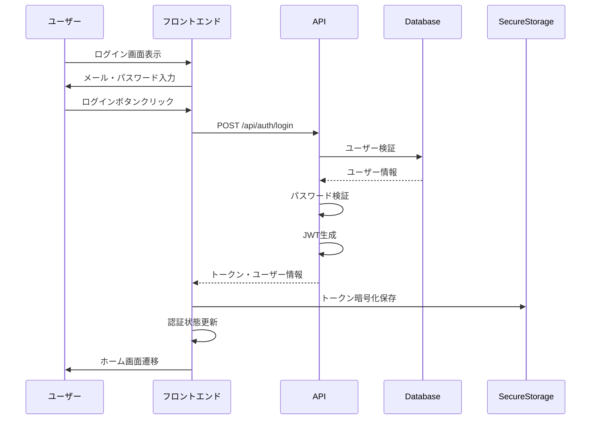
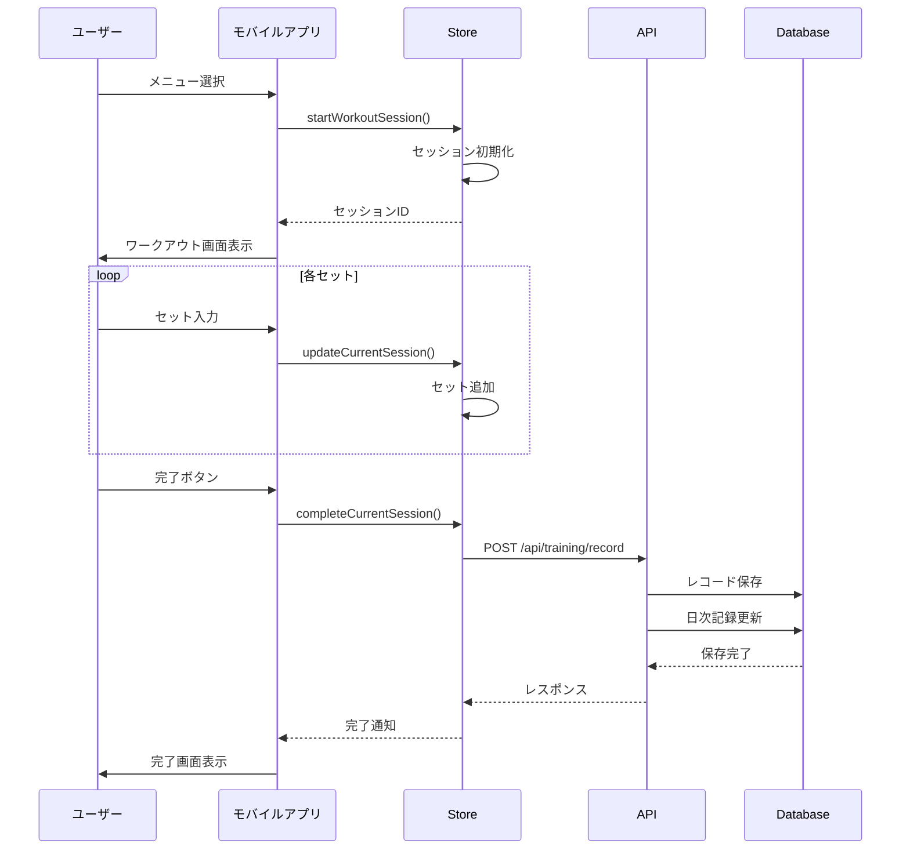
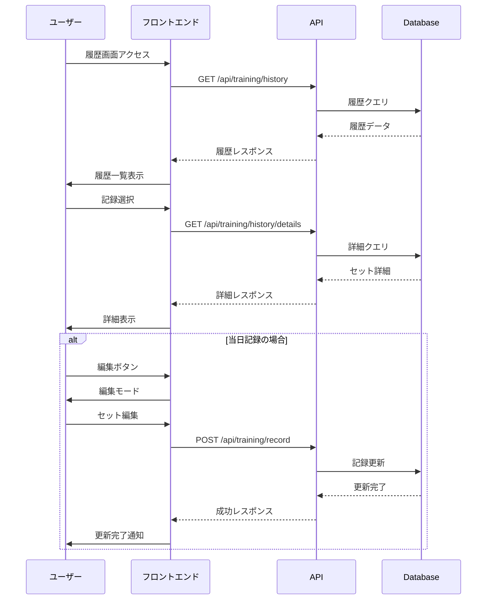

# Message トレーニング管理システム設計書

## 1. システム概要

### 1.1 プロジェクト概要
「Message」は、トレーニング・ワークアウトを記録・管理するための総合的なフィットネス管理システムです。

### 1.2 技術スタック
- **フロントエンド**: Vue 3 + Nuxt 3 + TypeScript
- **バックエンド**: ASP.NET Core 8.0 + Entity Framework Core
- **モバイルアプリ**: React Native + TypeScript
- **データベース**: PostgreSQL 15
- **認証**: JWT (JSON Web Token)
- **コンテナ**: Docker + Docker Compose
- **CI/CD**: GitHub Actions

## 2. 機能一覧

### 2.1 認証・ユーザー管理
- ユーザー登録
- ログイン/ログアウト
- JWTトークンベース認証
- パスワードハッシュ化（BCrypt）
- トークン自動更新
- セキュアストレージ（暗号化）

### 2.2 トレーニングメニュー管理
- メニュー一覧表示
- タグによる分類（部位別、難易度別など）
- メニュー検索・フィルタリング
- お気に入り機能
- メニュー詳細表示

### 2.3 トレーニング記録
- ワークアウトセッション開始
- セット・レップス・重量の記録
- リアルタイムタイマー
- 休憩タイマー
- セッション完了・保存
- 記録の編集・削除

### 2.4 トレーニング履歴
- 履歴一覧表示
- 日付範囲フィルタリング
- メニュー別フィルタリング
- 当日記録の編集
- 過去記録の詳細表示
- 統計情報表示

### 2.5 プリセット管理
- トレーニングプリセット作成
- プリセット一覧表示
- プリセット編集・削除
- デフォルトセット設定
- プリセットからのワークアウト開始

### 2.6 ダッシュボード・分析
- トレーニング統計表示
- 進捗グラフ
- パーソナルレコード
- 最近のアクティビティ
- カレンダービュー
- スマートレコメンデーション

### 2.7 通知・フィードバック
- トースト通知
- ワークアウト通知
- 音声フィードバック（モバイル）
- 振動フィードバック（モバイル）
- 達成バッジ

### 2.8 データ管理
- オフラインデータ永続化
- 自動同期
- データエクスポート
- バックアップ機能

## 3. システムアーキテクチャ



## 4. データベース設計（ER図）



## 5. API設計

### 5.1 認証エンドポイント

| メソッド | エンドポイント | 説明 | 認証 |
|---------|---------------|------|------|
| POST | /api/auth/register | ユーザー登録 | 不要 |
| POST | /api/auth/login | ログイン | 不要 |
| POST | /api/auth/refresh | トークン更新 | 必要 |
| POST | /api/auth/logout | ログアウト | 必要 |

### 5.2 トレーニングエンドポイント

| メソッド | エンドポイント | 説明 | 認証 |
|---------|---------------|------|------|
| GET | /api/training/menu | メニュー・タグ一覧取得 | 不要 |
| GET | /api/training/menu/isolation | アイソレーション種目取得 | 不要 |
| POST | /api/training/record | トレーニング記録登録 | 必要 |
| GET | /api/training/history | トレーニング履歴取得 | 必要 |
| GET | /api/training/history/details | 詳細記録取得 | 必要 |
| GET | /api/training/presets | プリセット一覧取得 | 必要 |
| POST | /api/training/presets | プリセット作成 | 必要 |
| DELETE | /api/training/presets/{id} | プリセット削除 | 必要 |
| GET | /api/training/schedules | スケジュール取得 | 必要 |
| POST | /api/training/schedules | スケジュール作成 | 必要 |

### 5.3 管理者エンドポイント

| メソッド | エンドポイント | 説明 | 認証 |
|---------|---------------|------|------|
| POST | /api/admin/users/create | ユーザー作成 | Admin |
| GET | /api/admin/users | ユーザー一覧 | Admin |
| PUT | /api/admin/users/{id} | ユーザー更新 | Admin |
| DELETE | /api/admin/users/{id} | ユーザー削除 | Admin |

### 5.4 レスポンス形式

```typescript
// 成功レスポンス
{
  "success": true,
  "data": {
    // レスポンスデータ
  },
  "message": "成功メッセージ",
  "timestamp": "2024-01-15T10:00:00Z"
}

// エラーレスポンス
{
  "success": false,
  "error": {
    "code": "ERROR_CODE",
    "message": "エラーメッセージ",
    "details": {
      // 詳細情報
    }
  },
  "timestamp": "2024-01-15T10:00:00Z"
}
```

## 6. 画面フロー図



## 7. シーケンス図

### 7.1 ログインフロー



### 7.2 トレーニング記録フロー



### 7.3 履歴取得・編集フロー



## 8. セキュリティ設計

### 8.1 認証・認可
- JWT Bearer Token認証
- トークン有効期限: 7日間
- リフレッシュトークン実装
- Role-based Access Control (RBAC)

### 8.2 データ保護
- パスワード: BCryptハッシュ化
- API通信: HTTPS必須
- ローカルストレージ: XOR暗号化
- SQLインジェクション対策: パラメータ化クエリ

### 8.3 セキュリティヘッダー
```
X-Content-Type-Options: nosniff
X-Frame-Options: DENY
X-XSS-Protection: 1; mode=block
Content-Security-Policy: default-src 'self'
```

## 9. パフォーマンス最適化

### 9.1 フロントエンド
- コード分割（Code Splitting）
- 遅延ローディング（Lazy Loading）
- 画像最適化（WebP対応）
- Service Worker（PWA）
- APIレスポンスキャッシュ

### 9.2 バックエンド
- Entity Framework クエリ最適化
- 非同期処理
- レスポンス圧縮（Gzip）
- データベースインデックス最適化
- Redis キャッシュ（オプション）

### 9.3 モバイルアプリ
- React Native Hermes エンジン
- 画像キャッシュ
- オフラインファースト設計
- バッチAPI呼び出し
- メモリ管理最適化

## 10. 運用・監視

### 10.1 ロギング
- 構造化ログ（JSON形式）
- ログレベル管理
- リクエスト/レスポンスログ
- エラートラッキング
- ビジネスイベントログ

### 10.2 モニタリング
- Prometheus + Grafana
- ヘルスチェックエンドポイント
- パフォーマンスメトリクス
- エラー率監視
- データベース接続監視

### 10.3 バックアップ
- 日次自動バックアップ
- S3へのバックアップ転送
- 保持期間: 30日
- ポイントインタイムリカバリ

## 11. 開発環境

### 11.1 必要な環境
- Node.js 18+
- .NET SDK 8.0+
- PostgreSQL 15+
- Docker Desktop
- Git

### 11.2 開発フロー
1. Feature Branch作成
2. ローカル開発・テスト
3. Pull Request作成
4. コードレビュー
5. CI/CDパイプライン実行
6. マージ・自動デプロイ

### 11.3 コーディング規約
- TypeScript: ESLint + Prettier
- C#: .NET コーディング規約
- コミットメッセージ: Conventional Commits
- ブランチ命名: feature/*, bugfix/*, hotfix/*

## 12. 今後の拡張予定

### Phase 2
- ソーシャル機能（フォロー、共有）
- AIトレーニングアドバイザー
- 栄養管理機能
- Apple Watch/Wear OS連携

### Phase 3
- マルチ言語対応
- チーム/ジム管理機能
- オンラインコーチング
- 動画分析機能