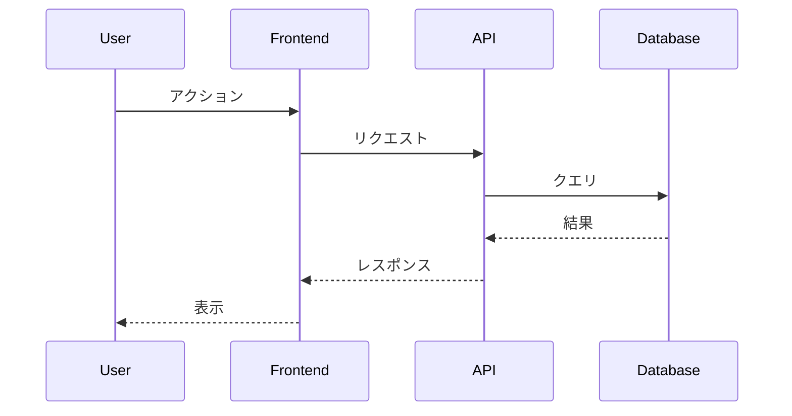
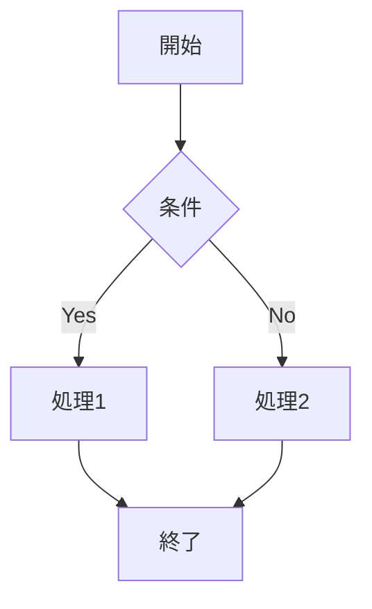
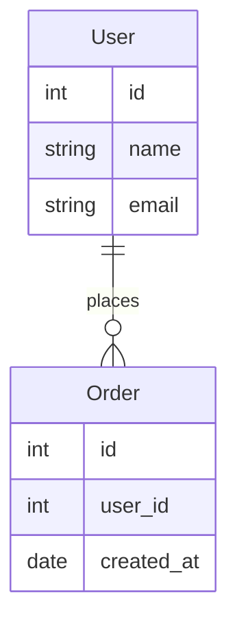

# テンプレート集

🧩 **よく使うファイルテンプレート集**

## 📄 ページテンプレート

### 基本ページテンプレート
```markdown
# ページタイトル

> ページの簡潔な説明（1-2行）

## 概要

このページの目的と内容の説明

## 主要セクション

### セクション1
内容の説明

### セクション2
内容の説明

## 参考リンク

- [関連ページ1](./page1.md)
- [関連ページ2](./page2.md)
```

### 機能詳細ページテンプレート
```markdown
# 機能名

💡 **機能の簡潔な説明**

## 🎯 機能概要

### 主な機能
- 機能1の説明
- 機能2の説明
- 機能3の説明

### 実装状況
- ✅ **実装済み**: 機能A, 機能B
- 🔄 **開発中**: 機能C, 機能D
- 📋 **計画中**: 機能E, 機能F

## 💻 技術仕様

### 使用技術
- **フロントエンド**: Vue 3, TypeScript
- **バックエンド**: ASP.NET Core 8.0
- **データベース**: PostgreSQL

### API エンドポイント
| メソッド | エンドポイント | 説明 |
|----------|----------------|------|
| `GET` | `/api/example` | データ取得 |
| `POST` | `/api/example` | データ作成 |

## 🎨 ユーザーインターフェース

### 画面構成
```
┌─────────────────────────┐
│ ヘッダー                │
├─────────────────────────┤
│ メインコンテンツ        │
│                         │
└─────────────────────────┘
```

### 操作フロー
1. 操作1の説明
2. 操作2の説明
3. 操作3の説明

## 📊 使用例

### 基本的な使用方法
1. 手順1
2. 手順2
3. 手順3

### 高度な使用方法
1. 高度な手順1
2. 高度な手順2

## 🔮 将来の拡張計画

- 拡張機能1
- 拡張機能2
- 拡張機能3
```

### API仕様ページテンプレート
```markdown
# API名

🔌 **API の簡潔な説明**

## 📋 API概要

### Base URL
```
https://api.message-app.com/api/category
```

### 認証
```http
Authorization: Bearer {access_token}
```

## 🎯 エンドポイント一覧

### データ取得

```http
GET /api/category/items
```

#### クエリパラメータ

| パラメータ | 型 | 必須 | 説明 |
|------------|----|----|------|
| `page` | integer | ❌ | ページ番号（デフォルト: 1） |
| `limit` | integer | ❌ | 1ページの件数（デフォルト: 20） |

#### レスポンス例
```json
{
  "success": true,
  "data": [
    {
      "id": 1,
      "name": "例"
    }
  ]
}
```

### データ作成

```http
POST /api/category/items
```

#### リクエストボディ
```json
{
  "name": "例",
  "description": "説明"
}
```

#### パラメータ

| フィールド | 型 | 必須 | 説明 |
|------------|----|----|------|
| `name` | string | ✅ | 名前（最大100文字） |
| `description` | string | ❌ | 説明（最大500文字） |

#### レスポンス例
```json
{
  "success": true,
  "data": {
    "id": 1,
    "name": "例",
    "description": "説明"
  },
  "message": "作成しました"
}
```

## 🔄 使用例

### cURL例
```bash
# データ取得
curl -X GET https://api.message-app.com/api/category/items \
  -H "Authorization: Bearer {token}"

# データ作成
curl -X POST https://api.message-app.com/api/category/items \
  -H "Content-Type: application/json" \
  -H "Authorization: Bearer {token}" \
  -d '{"name":"例","description":"説明"}'
```

### JavaScript例
```javascript
// データ取得
const response = await fetch('/api/category/items', {
  headers: {
    'Authorization': `Bearer ${token}`
  }
});
const data = await response.json();

// データ作成
const response = await fetch('/api/category/items', {
  method: 'POST',
  headers: {
    'Content-Type': 'application/json',
    'Authorization': `Bearer ${token}`
  },
  body: JSON.stringify({
    name: '例',
    description: '説明'
  })
});
```

## ❌ エラーコード

| コード | HTTPステータス | 説明 |
|--------|----------------|------|
| `ITEM_NOT_FOUND` | 404 | アイテムが見つからない |
| `VALIDATION_ERROR` | 400 | 入力データ検証エラー |
| `UNAUTHORIZED` | 401 | 認証エラー |
```

## 🧩 設定ファイルテンプレート

### VitePress基本設定
```javascript
import { defineConfig } from 'vitepress'

export default defineConfig({
  title: 'サイトタイトル',
  description: 'サイトの説明',
  lang: 'ja-JP',
  
  themeConfig: {
    nav: [
      { text: 'ホーム', link: '/' },
      { text: 'カテゴリ1', link: '/category1/' },
      { text: 'カテゴリ2', link: '/category2/' }
    ],
    
    sidebar: {
      '/category1/': [
        {
          text: 'セクション名',
          items: [
            { text: 'ページ1', link: '/category1/page1' },
            { text: 'ページ2', link: '/category1/page2' }
          ]
        }
      ]
    },
    
    socialLinks: [
      { icon: 'github', link: 'https://github.com/user/repo' }
    ]
  },
  
  markdown: {
    lineNumbers: true
  }
})
```

### カスタムテーマ
```javascript
// .vitepress/theme/index.js
import DefaultTheme from 'vitepress/theme'
import './style.css'

export default {
  extends: DefaultTheme,
  enhanceApp({ app, router, siteData }) {
    // アプリレベルの拡張
  }
}
```

### カスタムスタイル
```css
/* .vitepress/theme/style.css */
:root {
  /* ブランドカラー */
  --vp-c-brand-1: #3eaf7c;
  --vp-c-brand-2: #369870;
  --vp-c-brand-3: #2d8063;
  
  /* アクセントカラー */
  --vp-c-accent-1: #fd6f3a;
}

/* ヒーローセクション */
.VPHero .name {
  background: linear-gradient(135deg, var(--vp-c-brand-1), var(--vp-c-accent-1));
  -webkit-background-clip: text;
  -webkit-text-fill-color: transparent;
  background-clip: text;
}

/* 機能カード */
.VPFeature {
  border: 1px solid var(--vp-c-border);
  border-radius: 12px;
  transition: all 0.3s ease;
}

.VPFeature:hover {
  border-color: var(--vp-c-brand-1);
  box-shadow: 0 8px 25px rgba(62, 175, 124, 0.15);
  transform: translateY(-2px);
}
```

## 📊 表テンプレート

### 機能実装状況表
```markdown
| 機能 | 状況 | 説明 | 優先度 |
|------|------|------|--------|
| 機能A | ✅ 完了 | 機能Aの説明 | High |
| 機能B | 🔄 開発中 | 機能Bの説明 | Medium |
| 機能C | 📋 計画中 | 機能Cの説明 | Low |
```

### API エンドポイント表
```markdown
| メソッド | エンドポイント | 説明 | 認証 |
|----------|----------------|------|------|
| `GET` | `/api/items` | 一覧取得 | 必要 |
| `POST` | `/api/items` | 作成 | 必要 |
| `PUT` | `/api/items/{id}` | 更新 | 必要 |
| `DELETE` | `/api/items/{id}` | 削除 | 必要 |
```

### 技術スタック表
```markdown
| 分野 | 技術 | バージョン |
|------|------|-----------|
| フロントエンド | Vue 3 | 3.4.0 |
| バックエンド | ASP.NET Core | 8.0 |
| データベース | PostgreSQL | 15 |
| モバイル | React Native | 0.72.6 |
```

## 🔧 コンポーネントテンプレート

### 情報ボックス
```markdown
::: tip ヒント
これは便利なヒントです。
:::

::: warning 注意
これは注意事項です。
:::

::: danger 重要
これは重要な警告です。
:::

::: info 情報
これは追加情報です。
:::
```

### コードグループ
```markdown
::: code-group

```js [JavaScript]
const example = 'JavaScript code'
```

```ts [TypeScript]
const example: string = 'TypeScript code'
```

```csharp [C#]
string example = "C# code";
```

:::
```

### バッジ
```markdown
<Badge type="info" text="新機能" />
<Badge type="tip" text="推奨" />
<Badge type="warning" text="注意" />
<Badge type="danger" text="非推奨" />
```

## 📋 チェックリストテンプレート

### ページ作成チェックリスト
```markdown
- [ ] ページタイトルが適切
- [ ] 概要が明確
- [ ] 見出し階層が論理的
- [ ] 内部リンクが正しい
- [ ] 例やサンプルコードがある
- [ ] モバイルで適切に表示
- [ ] 誤字・脱字がない
```

### API仕様チェックリスト
```markdown
- [ ] エンドポイントが明確
- [ ] 認証方式が説明されている
- [ ] パラメータの型・必須項目が明記
- [ ] レスポンス例がある
- [ ] エラーコードが記載されている
- [ ] 使用例（cURL, JavaScript等）がある
- [ ] ステータスコードが正しい
```

## 🎨 Mermaid図表テンプレート

### シーケンス図


### フローチャート


### ER図


---

**💡 使い方**: 必要なテンプレートをコピーして、内容を実際の情報に置き換えてください。