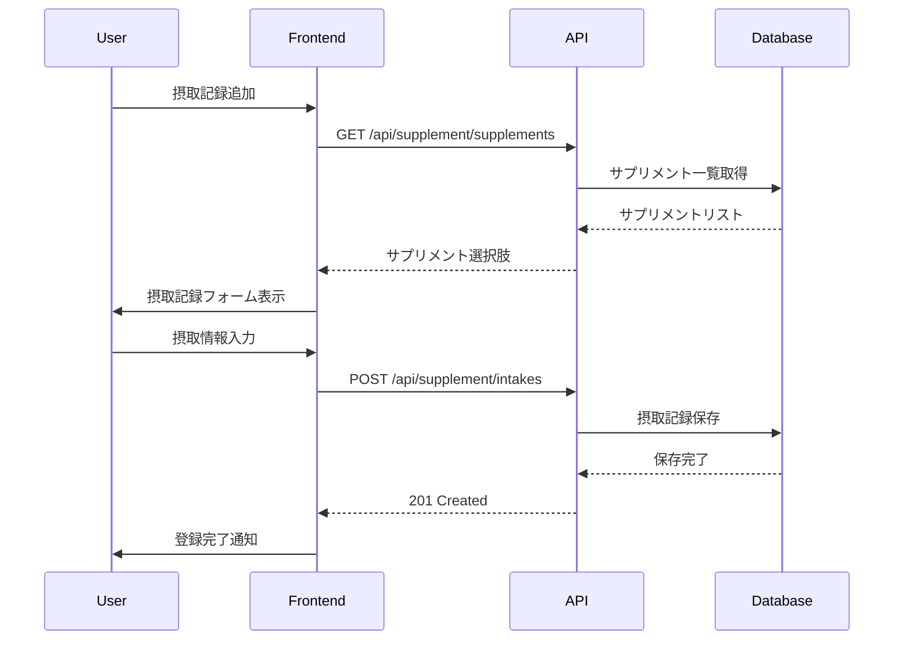

# サプリメントAPI

💊 **サプリメント管理に関するAPI仕様**

サプリメントの登録・管理、摂取記録、スケジュール管理に関するAPIエンドポイントの詳細仕様です。

## 🎯 API概要

### Base Path
```
/api/supplement
```

### 認証
全てのサプリメントAPIは認証が必要です。

```http
Authorization: Bearer {access_token}
```

### レート制限
- **50リクエスト/分**: サプリメント関連の全エンドポイント

---

## 📋 サプリメント管理

### サプリメント一覧取得

```http
GET /api/supplement/supplements
```

ユーザーが登録したサプリメントの一覧を取得します。

#### レスポンス例
```json
{
  "success": true,
  "data": [
    {
      "supplementId": 1,
      "supplementName": "プロテイン",
      "unit": "g",
      "description": "ホエイプロテイン（バニラ味）"
    },
    {
      "supplementId": 2,
      "supplementName": "BCAA",
      "unit": "g",
      "description": "運動前後に摂取"
    }
  ]
}
```

---

### サプリメント登録

```http
POST /api/supplement/supplements
```

新しいサプリメントを登録します。

#### リクエストボディ
```json
{
  "supplementName": "プロテイン",
  "unit": "g",
  "description": "ホエイプロテイン（バニラ味）"
}
```

#### パラメータ

| フィールド | 型 | 必須 | 説明 |
|------------|----|----|------|
| `supplementName` | string | ✅ | サプリメント名（最大100文字） |
| `unit` | string | ✅ | 単位（g, mg, 錠, カプセル, ml など）（最大20文字） |
| `description` | string | ❌ | 説明・メモ（最大500文字） |

#### レスポンス例
```json
{
  "success": true,
  "data": {
    "supplementId": 1,
    "supplementName": "プロテイン",
    "unit": "g",
    "description": "ホエイプロテイン（バニラ味）"
  },
  "message": "サプリメントを登録しました"
}
```

#### エラーレスポンス
```json
{
  "success": false,
  "error": {
    "code": "VALIDATION_ERROR",
    "message": "入力データが不正です",
    "details": {
      "supplementName": ["サプリメント名は必須です"],
      "unit": ["単位は必須です"]
    }
  }
}
```

---

### サプリメント更新

```http
PUT /api/supplement/supplements/{id}
```

既存のサプリメント情報を更新します。

#### パスパラメータ

| パラメータ | 型 | 説明 |
|------------|----|----|
| `id` | integer | サプリメントID |

#### リクエストボディ
```json
{
  "supplementName": "プロテイン（更新版）",
  "unit": "g",
  "description": "カゼインプロテイン（チョコ味）"
}
```

#### レスポンス例
```json
{
  "success": true,
  "message": "サプリメントを更新しました"
}
```

---

### サプリメント削除

```http
DELETE /api/supplement/supplements/{id}
```

サプリメントを削除します（論理削除）。

#### パスパラメータ

| パラメータ | 型 | 説明 |
|------------|----|----|
| `id` | integer | サプリメントID |

#### レスポンス例
```json
{
  "success": true,
  "message": "サプリメントを削除しました"
}
```

#### エラーレスポンス
```json
{
  "success": false,
  "error": {
    "code": "NOT_FOUND",
    "message": "サプリメントが見つかりません"
  }
}
```

---

## 📅 摂取記録管理

### 摂取記録取得

```http
GET /api/supplement/intakes
```

指定した日付の摂取記録を取得します。

#### クエリパラメータ

| パラメータ | 型 | 必須 | 説明 |
|------------|----|----|------|
| `date` | string | ❌ | 取得日（YYYY-MM-DD形式、デフォルト: 今日） |

#### リクエスト例
```http
GET /api/supplement/intakes?date=2024-01-15
```

#### レスポンス例
```json
{
  "success": true,
  "data": [
    {
      "recordId": 1,
      "supplementId": 1,
      "supplementName": "プロテイン",
      "unit": "g",
      "intakeDate": "2024-01-15",
      "intakeTime": "08:30:00",
      "amount": 30,
      "timingType": "朝食後",
      "memo": "トレーニング後"
    },
    {
      "recordId": 2,
      "supplementId": 2,
      "supplementName": "BCAA",
      "unit": "g",
      "intakeDate": "2024-01-15",
      "intakeTime": "14:30:00",
      "amount": 5,
      "timingType": "トレーニング前",
      "memo": null
    }
  ]
}
```

---

### 摂取記録登録

```http
POST /api/supplement/intakes
```

新しい摂取記録を登録します。

#### リクエストボディ
```json
{
  "supplementId": 1,
  "intakeDate": "2024-01-15",
  "intakeTime": "08:30:00",
  "amount": 30,
  "timingType": "朝食後",
  "memo": "トレーニング後"
}
```

#### パラメータ

| フィールド | 型 | 必須 | 説明 |
|------------|----|----|------|
| `supplementId` | integer | ✅ | サプリメントID |
| `intakeDate` | string | ✅ | 摂取日（YYYY-MM-DD形式） |
| `intakeTime` | string | ✅ | 摂取時間（HH:MM:SS形式） |
| `amount` | decimal | ✅ | 摂取量 |
| `timingType` | string | ❌ | タイミング（朝、昼、夜、トレーニング前、トレーニング後、食前、食後、就寝前） |
| `memo` | string | ❌ | メモ（最大500文字） |

#### レスポンス例
```json
{
  "success": true,
  "message": "摂取記録を保存しました",
  "data": {
    "recordId": 1,
    "supplementId": 1,
    "supplementName": "プロテイン",
    "unit": "g",
    "intakeDate": "2024-01-15",
    "intakeTime": "08:30:00",
    "amount": 30,
    "timingType": "朝食後",
    "memo": "トレーニング後"
  }
}
```

---

### 摂取記録削除

```http
DELETE /api/supplement/intakes/{id}
```

摂取記録を削除します。

#### パスパラメータ

| パラメータ | 型 | 説明 |
|------------|----|----|
| `id` | integer | 摂取記録ID |

#### レスポンス例
```json
{
  "success": true,
  "message": "摂取記録を削除しました"
}
```

---

## ⏰ スケジュール管理

### スケジュール一覧取得

```http
GET /api/supplement/schedules
```

ユーザーが設定したスケジュールの一覧を取得します。

#### レスポンス例
```json
{
  "success": true,
  "data": [
    {
      "scheduleId": 1,
      "supplementId": 1,
      "supplementName": "プロテイン",
      "unit": "g",
      "scheduleTime": "08:30:00",
      "amount": 30,
      "timingType": "朝食後",
      "daysOfWeek": "ALL",
      "memo": "毎日摂取"
    },
    {
      "scheduleId": 2,
      "supplementId": 2,
      "supplementName": "BCAA",
      "unit": "g",
      "scheduleTime": "14:30:00",
      "amount": 5,
      "timingType": "トレーニング前",
      "daysOfWeek": "1,3,5",
      "memo": "トレーニング日のみ"
    }
  ]
}
```

---

### スケジュール作成

```http
POST /api/supplement/schedules
```

新しいスケジュールを作成します。

#### リクエストボディ
```json
{
  "supplementId": 1,
  "scheduleTime": "08:30:00",
  "amount": 30,
  "timingType": "朝食後",
  "daysOfWeek": "ALL",
  "memo": "毎日摂取"
}
```

#### パラメータ

| フィールド | 型 | 必須 | 説明 |
|------------|----|----|------|
| `supplementId` | integer | ✅ | サプリメントID |
| `scheduleTime` | string | ✅ | 時間（HH:MM:SS形式） |
| `amount` | decimal | ✅ | 摂取量 |
| `timingType` | string | ❌ | タイミング |
| `daysOfWeek` | string | ❌ | 曜日設定（デフォルト: "ALL"） |
| `memo` | string | ❌ | メモ（最大500文字） |

#### 曜日設定値

| 値 | 説明 |
|----|------|
| `ALL` | 毎日 |
| `1,2,3,4,5` | 平日（月〜金） |
| `6,7` | 週末（土日） |
| `1,3,5` | 月水金 |
| `2,4` | 火木 |
| カスタム | 数字をカンマ区切り（1=月曜, 2=火曜, ..., 7=日曜） |

#### レスポンス例
```json
{
  "success": true,
  "message": "スケジュールを作成しました",
  "data": {
    "scheduleId": 1,
    "supplementId": 1,
    "supplementName": "プロテイン",
    "unit": "g",
    "scheduleTime": "08:30:00",
    "amount": 30,
    "timingType": "朝食後",
    "daysOfWeek": "ALL",
    "memo": "毎日摂取"
  }
}
```

---

### スケジュール削除

```http
DELETE /api/supplement/schedules/{id}
```

スケジュールを削除します（論理削除）。

#### パスパラメータ

| パラメータ | 型 | 説明 |
|------------|----|----|
| `id` | integer | スケジュールID |

#### レスポンス例
```json
{
  "success": true,
  "message": "スケジュールを削除しました"
}
```

---

## 📊 統計・分析（将来実装予定）

### 摂取統計取得

```http
GET /api/supplement/stats
```

摂取統計データを取得します。

#### クエリパラメータ

| パラメータ | 型 | 必須 | 説明 |
|------------|----|----|------|
| `period` | string | ❌ | 期間（week, month, year）（デフォルト: week） |
| `supplementId` | integer | ❌ | 特定サプリメントの統計 |

#### レスポンス例
```json
{
  "success": true,
  "data": {
    "period": "week",
    "totalIntakes": 21,
    "scheduledIntakes": 28,
    "adherenceRate": 75.0,
    "supplementStats": [
      {
        "supplementId": 1,
        "supplementName": "プロテイン",
        "totalAmount": 210,
        "intakeCount": 7,
        "averageDaily": 30
      }
    ]
  }
}
```

---

## 🔄 シーケンス図

### 摂取記録登録フロー



---

## 🧪 テスト例

### cURL例

#### サプリメント登録
```bash
curl -X POST https://api.message-app.com/api/supplement/supplements \
  -H "Content-Type: application/json" \
  -H "Authorization: Bearer {token}" \
  -d '{
    "supplementName": "プロテイン",
    "unit": "g",
    "description": "ホエイプロテイン"
  }'
```

#### 摂取記録登録
```bash
curl -X POST https://api.message-app.com/api/supplement/intakes \
  -H "Content-Type: application/json" \
  -H "Authorization: Bearer {token}" \
  -d '{
    "supplementId": 1,
    "intakeDate": "2024-01-15",
    "intakeTime": "08:30:00",
    "amount": 30,
    "timingType": "朝食後"
  }'
```

### JavaScript例（fetch）

```javascript
// サプリメント一覧取得
const getSupplements = async () => {
  const response = await fetch('/api/supplement/supplements', {
    headers: {
      'Authorization': `Bearer ${token}`
    }
  });
  const data = await response.json();
  return data;
};

// 摂取記録登録
const recordIntake = async (intakeData) => {
  const response = await fetch('/api/supplement/intakes', {
    method: 'POST',
    headers: {
      'Content-Type': 'application/json',
      'Authorization': `Bearer ${token}`
    },
    body: JSON.stringify(intakeData)
  });
  const data = await response.json();
  return data;
};
```

---

## ❌ エラーコード

| コード | HTTPステータス | 説明 |
|--------|----------------|------|
| `SUPPLEMENT_NOT_FOUND` | 404 | サプリメントが見つからない |
| `INTAKE_RECORD_NOT_FOUND` | 404 | 摂取記録が見つからない |
| `SCHEDULE_NOT_FOUND` | 404 | スケジュールが見つからない |
| `VALIDATION_ERROR` | 400 | 入力データ検証エラー |
| `UNAUTHORIZED` | 401 | 認証エラー |
| `RATE_LIMIT_EXCEEDED` | 429 | レート制限超過 |

---

## 📝 変更履歴

### v1.2.0 (2024-01-15)
- ✅ サプリメント管理API新規追加
- ✅ 摂取記録API実装
- ✅ スケジュール管理API実装

### v1.3.0 (予定)
- 📋 統計・分析API追加
- 📋 通知設定API追加
- 📋 在庫管理API追加

---

**🔗 関連ドキュメント**
- [認証API](/api/auth) - JWT認証の詳細
- [エラーコード一覧](/api/errors) - 全APIエラーコード
- [機能詳細](/features/supplement) - サプリメント機能の概要