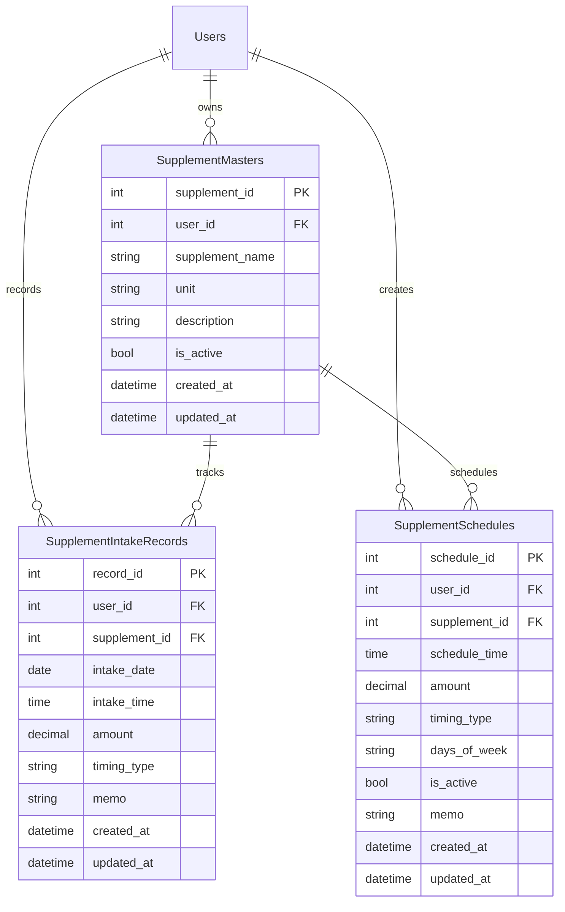

# サプリメント管理機能

💊 **サプリメント摂取の記録・管理・分析を一元化**

トレーニングと並んで重要なサプリメント摂取を効率的に管理できる包括的な機能セットです。

## 🎯 機能概要

### ✅ 実装済み機能

#### 📋 サプリメント登録・管理
- **サプリメント情報管理**
  - 名前、単位、説明の登録
  - カスタム単位設定（g, mg, 錠, カプセル など）
  - 説明・メモ機能
- **CRUD操作**
  - 作成、読み取り、更新、削除
  - 論理削除による安全な管理
  - ユーザー別データ分離

#### 📅 摂取記録機能
- **詳細な摂取記録**
  - 日時指定（日付 + 時刻）
  - 摂取量の記録
  - タイミング分類
  - メモ・備考欄
- **摂取タイミング**
  - 朝 / 昼 / 夜
  - トレーニング前 / トレーニング後
  - 食前 / 食後
  - 就寝前
  - カスタムタイミング

#### ⏰ スケジュール管理
- **定期摂取設定**
  - 時間指定（HH:MM 形式）
  - 曜日指定（毎日、平日、週末、カスタム）
  - 摂取量設定
  - スケジュール有効/無効切り替え
- **柔軟な繰り返し設定**
  - 毎日
  - 平日のみ（月〜金）
  - 週末のみ（土日）
  - 特定曜日（月水金 など）

#### 📊 摂取統計・分析
- **日別統計**
  - 当日の摂取記録一覧
  - 摂取予定との比較
  - 摂取率の可視化
- **期間別分析**
  - 週間・月間摂取傾向
  - サプリメント別摂取頻度
  - 習慣化の進捗確認

### 🔄 開発中機能

#### 🔔 スマート通知
- **摂取リマインダー**
  - スケジュール基準の通知
  - カスタマイズ可能な通知タイミング
  - スヌーズ機能
- **在庫管理通知**
  - 残量アラート
  - 補充リマインダー

#### 📈 高度な分析
- **摂取パターン分析**
  - 摂取頻度グラフ
  - 時間帯別摂取傾向
  - トレーニングとの相関分析
- **効果分析**
  - 体調・パフォーマンスとの関連
  - 最適摂取タイミングの提案

## 💻 技術仕様

### データベース設計



### API エンドポイント

#### サプリメント管理
```http
GET    /api/supplement/supplements      # サプリメント一覧取得
POST   /api/supplement/supplements      # サプリメント登録
PUT    /api/supplement/supplements/{id} # サプリメント更新
DELETE /api/supplement/supplements/{id} # サプリメント削除
```

#### 摂取記録
```http
GET    /api/supplement/intakes          # 摂取記録取得（日付指定可）
POST   /api/supplement/intakes          # 摂取記録登録
DELETE /api/supplement/intakes/{id}     # 摂取記録削除
```

#### スケジュール管理
```http
GET    /api/supplement/schedules        # スケジュール一覧取得
POST   /api/supplement/schedules        # スケジュール作成
DELETE /api/supplement/schedules/{id}   # スケジュール削除
```

### フロントエンド構成

#### Vue.js Composable
```typescript
export const useSupplement = () => {
  // 状態管理
  const supplements = ref<Supplement[]>([])
  const intakeRecords = ref<IntakeRecord[]>([])
  const schedules = ref<Schedule[]>([])
  
  // API操作
  const fetchSupplements = async () => { ... }
  const createSupplement = async (data) => { ... }
  const recordIntake = async (data) => { ... }
  const createSchedule = async (data) => { ... }
  
  return {
    supplements,
    intakeRecords,
    schedules,
    // ... methods
  }
}
```

#### コンポーネント構造
```
components/supplements/
├── SupplementModal.vue      # サプリメント追加・編集
├── IntakeRecordModal.vue    # 摂取記録追加
├── ScheduleModal.vue        # スケジュール設定
└── SupplementCard.vue       # サプリメント表示カード
```

## 🎨 ユーザーインターフェース

### メイン画面
```
┌─────────────────────────────────────────────┐
│ サプリメント管理                             │
├─────────────────────────────────────────────┤
│ [摂取記録] [サプリ一覧] [スケジュール]       │ ← タブナビゲーション
│                                             │
│ ■ 摂取記録タブ                              │
│  日付: [2024/01/15] [摂取記録を追加]        │
│                                             │
│  今日の摂取記録:                            │
│  ┌─────────────────────────────────────┐   │
│  │ 08:30 プロテイン                     │   │
│  │ 30g | 朝食後                        │   │
│  │ メモ: トレーニング後摂取              │   │
│  │ [編集] [削除]                       │   │
│  └─────────────────────────────────────┘   │
└─────────────────────────────────────────────┘
```

### 摂取記録モーダル
```
┌───────────────────────────────┐
│     摂取記録追加        [✕]   │
├───────────────────────────────┤
│  💊 サプリメント              │
│  [プロテイン          ▼]     │
│                               │
│  🕐 摂取時間                  │
│  [08:30                  ]   │
│                               │
│  ⚖️ 摂取量                    │
│  [30] g                      │
│                               │
│  🍽️ タイミング                │
│  [朝食後             ▼]     │
│                               │
│  [    キャンセル    ] [保存]  │
└───────────────────────────────┘
```

## 📱 モバイル対応

### React Native 実装
- **ネイティブ通知**: プッシュ通知によるリマインダー
- **オフライン対応**: AsyncStorage による局所データ保存
- **バックグラウンド同期**: ネットワーク復旧時の自動同期

### モバイル画面設計
```
┌─────────────────────┐
│ 💊 サプリメント     │
├─────────────────────┤
│ 今日の予定 (3/5)    │
│ ○ プロテイン 08:00  │
│ ✓ BCAA     12:00    │
│ ○ 亜鉛     21:00    │
│                     │
│ [摂取記録を追加]    │
│                     │
│ 最近の記録:         │
│ • プロテイン 30g    │
│ • ビタミンC 1000mg  │
├─────────────────────┤
│ [🏠] [📊] [💊] [⚙️]│
└─────────────────────┘
```

## 🧪 テスト設計

### 単体テスト
```typescript
describe('useSupplement', () => {
  test('サプリメント作成', async () => {
    const { createSupplement } = useSupplement()
    const data = {
      supplementName: 'プロテイン',
      unit: 'g',
      description: 'ホエイプロテイン'
    }
    const result = await createSupplement(data)
    expect(result.supplementName).toBe('プロテイン')
  })
})
```

### 統合テスト
```csharp
[Test]
public async Task CreateSupplement_ValidData_ReturnsCreated()
{
    // Arrange
    var request = new CreateSupplementRequest
    {
        SupplementName = "プロテイン",
        Unit = "g",
        Description = "ホエイプロテイン"
    };

    // Act
    var response = await _client.PostAsync("/api/supplement/supplements", 
        JsonContent.Create(request));

    // Assert
    Assert.AreEqual(HttpStatusCode.Created, response.StatusCode);
}
```

## 📊 使用例・ワークフロー

### 1. 新規サプリメント登録
1. 「サプリメント一覧」タブを開く
2. 「新規サプリ追加」ボタンクリック
3. 必要情報を入力して保存

### 2. 定期摂取スケジュール設定
1. 「スケジュール」タブを開く
2. 「新規スケジュール追加」ボタンクリック
3. サプリメント、時間、曜日を設定

### 3. 摂取記録の登録
1. 「摂取記録」タブを開く
2. 「摂取記録を追加」ボタンクリック
3. 摂取したサプリメントの詳細を記録

### 4. 摂取状況の確認
1. カレンダーから日付を選択
2. その日の摂取記録・予定を確認
3. 未摂取項目があれば追加記録

## 🔮 将来の拡張計画

### Phase 1: 通知機能強化
- スマートリマインダー
- 摂取忘れアラート
- カスタム通知音

### Phase 2: 在庫管理
- 残量追跡
- 自動補充提案
- 購入履歴管理

### Phase 3: 効果分析
- 体調との相関分析
- パフォーマンス向上分析
- 最適摂取パターン提案

### Phase 4: 外部連携
- ECサイト連携
- 栄養データベース連携
- ヘルスケアアプリ同期

---

サプリメント管理機能により、トレーニングと栄養摂取の両面から包括的な健康管理が可能になります。