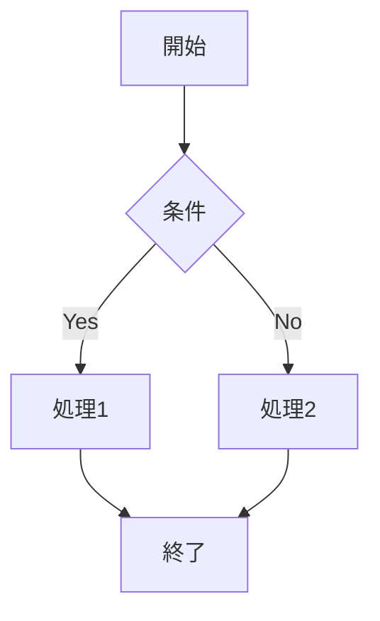

# セットアップガイド

🚀 **Message システム設計書サイトのセットアップ方法**

このガイドでは、設計書サイトの開発環境セットアップから本番デプロイまでを説明します。

## 📋 前提条件

### 必要なソフトウェア

| ソフトウェア | バージョン | 用途 |
|--------------|------------|------|
| **Node.js** | 18.0.0+ | VitePressの実行環境 |
| **npm** | 8.0.0+ | パッケージ管理 |
| **Git** | 2.30.0+ | バージョン管理 |

### システム要件

- **OS**: Windows 10+, macOS 10.15+, Ubuntu 18.04+
- **メモリ**: 4GB以上推奨
- **ストレージ**: 1GB以上の空き容量

## 🛠️ ローカル開発環境のセットアップ

### 1. リポジトリのクローン

```bash
# HTTPSでクローン
git clone https://github.com/Message-Team/Message.git

# SSHでクローン（推奨）
git clone git@github.com:Message-Team/Message.git

cd Message/docs
```

### 2. 依存関係のインストール

```bash
# npm を使用
npm install

# yarn を使用する場合
yarn install
```

### 3. 開発サーバーの起動

```bash
# 開発サーバー起動
npm run docs:dev

# または
yarn docs:dev
```

ブラウザで `http://localhost:5173` にアクセスしてサイトを確認できます。

### 4. 開発フロー

```bash
# ファイル変更の監視（自動リロード）
npm run docs:dev

# 本番ビルドのテスト
npm run docs:build
npm run docs:preview
```

## 📁 プロジェクト構造

```
docs/
├── .vitepress/
│   ├── config.js              # VitePress設定
│   ├── theme/
│   │   ├── index.js           # カスタムテーマ
│   │   └── style.css          # カスタムスタイル
│   └── cache/                 # ビルドキャッシュ
├── public/                    # 静的ファイル
│   ├── favicon.ico
│   └── logo.png
├── features/                  # 機能仕様
├── api/                       # API仕様
├── system/                    # システム設計
├── screens/                   # 画面設計
├── testing/                   # テスト設計
├── sequences/                 # シーケンス図
├── index.md                   # ホームページ
├── package.json
└── README.md
```

## ✍️ ドキュメント作成ガイド

### 新しいページの作成

1. **ディレクトリ選択**: 適切なカテゴリディレクトリを選択
2. **ファイル作成**: `.md` ファイルを作成
3. **Front Matter設定**: ページメタデータを記述
4. **サイドバー更新**: `.vitepress/config.js` を更新

#### Front Matter 例

```yaml
---
title: ページタイトル
description: ページの説明
outline: deep
prev: 
  text: '前のページ'
  link: '/path/to/prev'
next:
  text: '次のページ'
  link: '/path/to/next'
---
```

### マークダウン記法

#### 基本的な記法

```markdown
# 見出し1
## 見出し2
### 見出し3

**太字** *斜体* `コード`

- リスト項目1
- リスト項目2

1. 番号付きリスト1
2. 番号付きリスト2

[リンク](https://example.com)


```

#### VitePress拡張記法

```markdown
<!-- カスタムコンテナ -->
::: tip ヒント
これは便利なヒントです。
:::

::: warning 注意
これは注意事項です。
:::

::: danger 重要
これは重要な警告です。
:::

<!-- コードグループ -->
::: code-group

```js [config.js]
export default {
  name: 'my-project'
}
```

```ts [config.ts]
export default {
  name: 'my-project'
} as const
```

:::
```

#### Mermaid図表

```markdown

```

### API仕様ドキュメントの書き方

```markdown
## エンドポイント名

```http
GET /api/endpoint
```

### リクエスト

| パラメータ | 型 | 必須 | 説明 |
|------------|----|----|------|
| `param1` | string | ✅ | パラメータの説明 |
| `param2` | number | ❌ | オプションパラメータ |

### レスポンス

```json
{
  "success": true,
  "data": {
    "id": 1,
    "name": "example"
  }
}
```
```

## 🎨 カスタマイズ

### テーマカラーの変更

`docs/.vitepress/theme/style.css` を編集：

```css
:root {
  /* ブランドカラー */
  --vp-c-brand-1: #3eaf7c;
  --vp-c-brand-2: #369870;
  
  /* アクセントカラー */
  --vp-c-accent-1: #fd6f3a;
}
```

### ナビゲーションの設定

`docs/.vitepress/config.js` の `themeConfig.nav` を編集：

```js
nav: [
  { text: 'ホーム', link: '/' },
  { text: '新カテゴリ', link: '/new-category/' },
  {
    text: 'ドロップダウン',
    items: [
      { text: 'アイテム1', link: '/item1' },
      { text: 'アイテム2', link: '/item2' }
    ]
  }
]
```

### サイドバーの設定

```js
sidebar: {
  '/new-category/': [
    {
      text: 'セクション名',
      items: [
        { text: 'ページ1', link: '/new-category/page1' },
        { text: 'ページ2', link: '/new-category/page2' }
      ]
    }
  ]
}
```

## 🚀 デプロイ

### GitHub Pages（自動デプロイ）

1. **GitHub Actionsの有効化**: `.github/workflows/deploy-docs.yml` が存在することを確認
2. **Pages設定**: リポジトリ設定でGitHub Pagesを有効化
3. **プッシュ**: `main` ブランチにプッシュすると自動デプロイ

```bash
git add .
git commit -m "docs: update documentation"
git push origin main
```

### 手動ビルド・デプロイ

```bash
# ビルド
npm run docs:build

# ビルド結果の確認
npm run docs:preview

# 成果物は docs/.vitepress/dist/ に生成される
```

### その他のホスティング

#### Netlify

1. GitHubリポジトリを接続
2. ビルド設定:
   - **Build command**: `cd docs && npm run docs:build`
   - **Publish directory**: `docs/.vitepress/dist`

#### Vercel

1. プロジェクトをインポート
2. ルートディレクトリを `docs` に設定
3. ビルドコマンド: `npm run docs:build`
4. 出力ディレクトリ: `.vitepress/dist`

## 🔧 トラブルシューティング

### よくある問題と解決方法

#### 1. ビルドエラー

```bash
# Node.jsバージョンの確認
node --version

# キャッシュのクリア
rm -rf node_modules package-lock.json
npm install

# VitePressキャッシュのクリア
rm -rf .vitepress/cache
```

#### 2. 画像が表示されない

- 画像ファイルは `docs/public/` に配置
- マークダウンでは `/image.png` のようにルートパスで参照
- 相対パス `./images/image.png` も使用可能

#### 3. リンクが機能しない

```markdown
<!-- 正しい内部リンク -->
[ページへのリンク](/features/supplement)

<!-- 正しい外部リンク -->
[外部サイト](https://example.com)

<!-- アンカーリンク -->
[セクションへ](#section-title)
```

#### 4. Hot Reload が動作しない

```bash
# 開発サーバーの再起動
npm run docs:dev

# ポート変更
npm run docs:dev -- --port 3000
```

### パフォーマンスの最適化

```js
// .vitepress/config.js
export default {
  // ビルド最適化
  vite: {
    build: {
      rollupOptions: {
        output: {
          manualChunks: {
            'vue-vendor': ['vue', 'vue-router']
          }
        }
      }
    }
  }
}
```

## 📚 参考資料

### 公式ドキュメント

- [VitePress公式](https://vitepress.dev/)
- [Vue 3](https://vuejs.org/)
- [Markdown Guide](https://www.markdownguide.org/)

### 拡張機能

- [Mermaid図表](https://mermaid.js.org/)
- [KaTeX数式](https://katex.org/)
- [Shiki シンタックスハイライト](https://shiki.matsu.io/)

### 開発ツール

- [VS Code VitePress Extension](https://marketplace.visualstudio.com/items?itemName=Vue.volar)
- [Markdown All in One](https://marketplace.visualstudio.com/items?itemName=yzhang.markdown-all-in-one)

## 🆘 サポート

### ヘルプが必要な場合

1. **GitHub Issues**: [新しいIssueを作成](https://github.com/Message-Team/Message/issues/new)
2. **Discussions**: [ディスカッションに参加](https://github.com/Message-Team/Message/discussions)
3. **ドキュメント**: この設計書サイト

### 貢献方法

1. **フォーク**: リポジトリをフォーク
2. **ブランチ作成**: `git checkout -b feature/new-docs`
3. **変更**: ドキュメントを更新
4. **プルリクエスト**: 変更をプルリクエスト

---

**🎉 これで設計書サイトの開発環境が準備完了です！**

ドキュメント作成を始めましょう。質問がある場合は、お気軽にお声がけください。